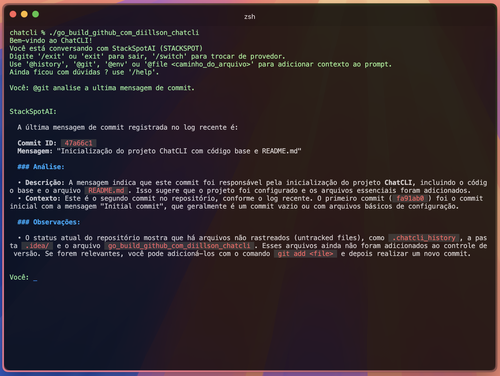
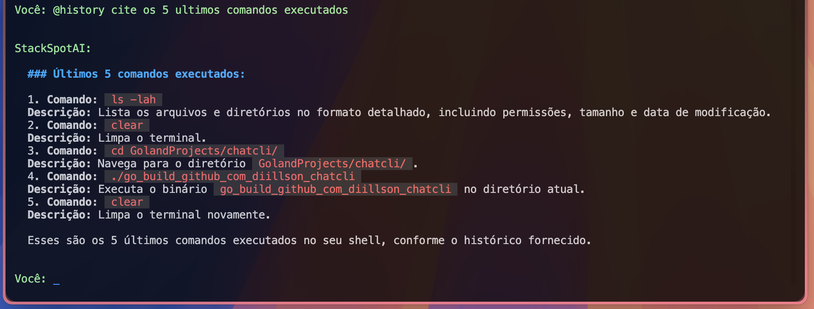
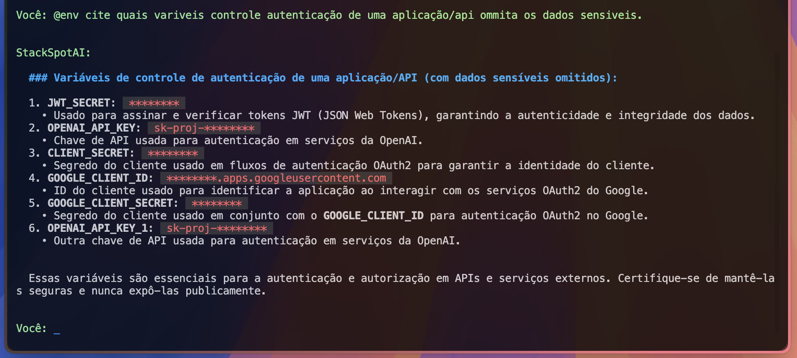

# ChatCLI

**ChatCLI** é uma aplicação de interface de linha de comando (CLI) avançada que utiliza modelos de Linguagem de Aprendizado (LLMs) poderosos como **StackSpot** e **OpenAI** para facilitar conversas interativas e contextuais diretamente no seu terminal. Projetado para desenvolvedores, cientistas de dados e entusiastas de tecnologia, o ChatCLI aumenta a produtividade integrando diversas fontes de dados contextuais e proporcionando uma experiência rica e amigável ao usuário.

## 🚀 Funcionalidades

- **Suporte a Múltiplos Provedores:** Alterne facilmente entre diferentes provedores de LLM como **StackSpot** e **OpenAI** conforme suas necessidades.
- **Experiência Interativa na CLI:** Desfrute de uma interação suave na linha de comando com recursos como navegação de histórico e auto-completação de comandos.
- **Comandos Contextuais:**
  - `@history` - Integra o histórico recente de comandos do seu shell na conversa.
  - `@git` - Adiciona informações do repositório Git atual, incluindo status, commits recentes e branches.
  - `@env` - Inclui suas variáveis de ambiente no contexto do chat.
  - `@file <caminho>` - Incorpora o conteúdo de arquivos especificados na conversa. Suporta `~` como atalho para o diretório home do usuário.
- **Feedback Animado:** Animações visuais de "Pensando..." enquanto o LLM processa suas solicitações, aumentando o engajamento do usuário.
- **Renderização de Markdown:** Respostas são renderizadas com Markdown para melhor legibilidade e formatação.
- **Histórico Persistente:** O histórico de comandos é salvo entre sessões, permitindo revisitar interações anteriores com facilidade.
- **Logging Robusto:** Registro abrangente utilizando **Zap** com rotação de logs e sanitização de informações sensíveis para garantir segurança e manutenibilidade.
- **Tratamento Avançado de Erros:** Mensagens de erro amigáveis e informativas orientam você em caso de problemas, garantindo uma experiência de usuário fluida.

## 📦 Instalação

### Pré-requisitos

- **Go:** Certifique-se de ter o Go instalado 1.21+. Você pode baixá-lo em [golang.org](https://golang.org/dl/).

### Passos

1. **Clonar o Repositório:**

   ```bash
   git clone https://github.com/diillson/chatcli.git
   cd chatcli
   ```

2. **Instalar Dependências:**

   ```bash
   go mod tidy
   ```

3. **Compilar a Aplicação:**

   ```bash
   go build -o chatcli
   ```

4. **Executar a Aplicação:**

   ```bash
   ./chatcli
   ```

## 🛠 Configuração

O ChatCLI depende de variáveis de ambiente para configurar seu comportamento e conectar-se aos provedores de LLM. Você pode definir essas variáveis em um arquivo `.env` na raiz do projeto ou exportá-las diretamente no seu shell.

### Variáveis de Ambiente

- **Geral:**
    - `LOG_LEVEL` - Define o nível de log (`debug`, `info`, `warn`, `error`). Padrão é `info`.
    - `ENV` - Define o ambiente (`prod` para produção, caso contrário, padrão é desenvolvimento).

- **Provedor OpenAI:**
    - `LLM_PROVIDER` - Especifica o provedor de LLM (`OPENAI` ou `STACKSPOT`). Padrão é `OPENAI`.
    - `OPENAI_API_KEY` - Sua chave de API da OpenAI.
    - `OPENAI_MODEL` - (Opcional) Especifica o modelo da OpenAI a ser usado. Padrão é `gpt-40-mini`.

- **Provedor StackSpot:**
    - `CLIENT_ID` - ID do cliente StackSpot.
    - `CLIENT_SECRET` - Segredo do cliente StackSpot.
    - `SLUG_NAME` - Nome do slug StackSpot.

### Exemplo de Arquivo `.env`

```env
# Configurações Gerais
LOG_LEVEL=info
ENV=dev

# Configurações do OpenAI
LLM_PROVIDER=OPENAI
OPENAI_API_KEY=sua-chave-openai
OPENAI_MODEL=gpt-4

# Configurações do StackSpot
CLIENT_ID=seu-cliente-id
CLIENT_SECRET=seu-cliente-secreto
SLUG_NAME=seu-slug-stackspot
```

## 🎯 Uso

Após instalar e configurar, você pode começar a usar o ChatCLI com diversos comandos.

### Iniciando o ChatCLI

```bash
./chatcli
```

### Comandos Disponíveis

- **Sair do ChatCLI:**
    - `/exit` ou `exit` ou `/quit` ou `quit`

- **Alternar Provedor de LLM:**
    - `/switch`

- **Ajuda:**
    - `/help`

- **Comandos Especiais:**
    - `@history` - Adiciona os últimos 10 comandos do shell ao contexto da conversa.
    - `@git` - Incorpora o status atual do repositório Git, commits recentes e branches.
    - `@env` - Inclui variáveis de ambiente no chat.
    - `@file <caminho>` - Adiciona o conteúdo do arquivo especificado ao contexto da conversa. Suporta `~` como atalho para o diretório home.
    - `@command <comando>` - Executa o comando de terminal fornecido e adiciona a saída ao contexto da conversa.

### Exemplos

1. **Conversa Básica:**

   ```plaintext
   Você: Olá, como você está?
   ```

2. **Incluindo Histórico do Shell:**

   ```plaintext
   Você: @history
   ```

3. **Adicionando Informações do Git:**

   ```plaintext
   Você: @git
   ```

4. **Incluindo Variáveis de Ambiente:**

   ```plaintext
   Você: @env
   ```

5. **Incorporando Conteúdo de Arquivo:**

   ```plaintext
   Você: @file ~/documentos/main.go
   ```

   Este comando lerá o conteúdo de `main.go` do diretório `documentos` na pasta home e o incluirá no contexto da conversa.


6. **sCREESHOTS:**

###



###



###



###


## 📂 Estrutura do Código

O projeto está organizado em vários pacotes, cada um responsável por diferentes aspectos da aplicação:

- **`cli`**: Gerencia a interface de linha de comando, entrada do usuário, processamento de comandos e interação com os clientes LLM.
- **`llm`**: Gerencia as interações com os Modelos de Linguagem, suportando múltiplos provedores como OpenAI e StackSpot.
- **`utils`**: Contém funções utilitárias para operações de arquivo, expansão de caminhos, logging e mais.
- **`models`**: Define as estruturas de dados utilizadas em toda a aplicação.
- **`main`**: Inicializa a aplicação, configura dependências e inicia a CLI.

## 📚 Bibliotecas e Dependências

- **[Zap](https://github.com/uber-go/zap)**: Logging estruturado e de alto desempenho.
- **[Liner](https://github.com/peterh/liner)**: Fornece edição de linha e histórico para a CLI.
- **[Glamour](https://github.com/charmbracelet/glamour)**: Renderiza Markdown no terminal.
- **[Lumberjack](https://github.com/natefinch/lumberjack)**: Rotação de arquivos de log.
- **[Godotenv](https://github.com/joho/godotenv)**: Carrega variáveis de ambiente a partir de um arquivo `.env`.
- **[Zap](https://github.com/uber-go/zap)**: Logging estruturado e nivelado.
- **[Biblioteca Padrão do Go](https://pkg.go.dev/std)**: Utiliza diversos pacotes padrão para requisições HTTP, manipulação de arquivos, concorrência e mais.

## 🌟 Funcionalidades Avançadas

- **Expansão de Caminhos com Suporte a `~`:** O comando `@file` expande inteligentemente `~` para o diretório home do usuário, permitindo entradas flexíveis de caminhos de arquivos semelhantes aos terminais Unix-like.

- **Animações Concorrentes:** Implementa goroutines para gerenciar animações como "Pensando..." sem bloquear a thread principal, garantindo uma experiência de usuário responsiva.

- **Mecanismo de Retry com Backoff Exponencial:** Tratamento robusto de erros com lógica de retry para requisições de rede aos provedores de LLM, aumentando a confiabilidade.

- **Gerenciamento de Tokens para StackSpot:** Gerencia tokens de acesso de forma segura, lidando com a renovação automática antes da expiração para manter o serviço ininterrupto.

- **Logging Sanitizado:** Garante que informações sensíveis como chaves de API e tokens sejam redigidas nos logs, mantendo as melhores práticas de segurança.

- **Renderização de Markdown:** Utiliza Glamour para renderizar respostas em Markdown, proporcionando uma saída rica e formatada no terminal.

- **Limitação de Tamanho de Arquivo:** Evita a leitura de arquivos excessivamente grandes (acima de 1MB) para manter o desempenho e prevenir possíveis problemas.

- **Compatibilidade com Shells:** Detecta automaticamente o shell do usuário (por exemplo, bash, zsh, fish) e lê o arquivo de histórico apropriado, melhorando a compatibilidade em diferentes ambientes.

## 📜 Integração de Logs

O ChatCLI integra **Zap** para logging estruturado e de alto desempenho. As principais características do sistema de logging incluem:

- **Níveis de Log Configuráveis:** Defina o nível de log desejado (`debug`, `info`, `warn`, `error`) via variáveis de ambiente para controlar a verbosidade.
- **Rotação de Logs:** Utiliza **Lumberjack** para gerenciar a rotação de arquivos de log, prevenindo que os arquivos cresçam indefinidamente.
- **Sanitização de Dados Sensíveis:** O `LoggingTransport` personalizado assegura que informações sensíveis como chaves de API e senhas sejam redigidas antes de serem registradas.
- **Logging de Multi-Output:** Suporta logging tanto no console quanto em arquivos de log, dependendo do ambiente (desenvolvimento ou produção).
- **Logs Detalhados de Requisições e Respostas:** Registra requisições HTTP e respostas, incluindo método, URL, cabeçalhos (com dados sensíveis redigidos), códigos de status e durações para monitoramento e depuração.

## 🧩 Como Funciona

1. **Inicialização:**
    - A aplicação carrega as variáveis de ambiente e inicializa o logger.
    - Configura o `LLMManager` para gerenciar múltiplos provedores de LLM com base na configuração.

2. **Processamento de Comandos:**
    - Os usuários interagem com o ChatCLI via terminal, inserindo comandos e mensagens.
    - Comandos especiais como `@history`, `@git`, `@env` e `@file` são analisados e processados para incluir contexto adicional na conversa.

3. **Interação com LLM:**
    - O ChatCLI envia a entrada do usuário juntamente com o histórico da conversa para o provedor de LLM selecionado.
    - A resposta do LLM é recebida, renderizada com Markdown e exibida com um efeito de máquina de escrever para melhor legibilidade.

4. **Logging e Tratamento de Erros:**
    - Todas as interações, incluindo requisições e respostas para/dos provedores de LLM, são registradas com níveis apropriados.
    - Erros são tratados de forma elegante, fornecendo mensagens informativas ao usuário e garantindo que a aplicação permaneça estável.

## 🧑‍💻 Contribuindo

Contribuições são bem-vindas! Seja melhorando a documentação, adicionando novos recursos ou corrigindo bugs, sua ajuda é muito apreciada. Siga os passos abaixo para contribuir:

1. **Fork o Repositório**
2. **Crie uma Nova Branch:**

   ```bash
   git checkout -b feature/SeuNomeDeFeature
   ```

3. **Commit suas Alterações:**

   ```bash
   git commit -m "Adiciona sua mensagem"
   ```

4. **Push para a Branch:**

   ```bash
   git push origin feature/SeuNomeDeFeature
   ```

5. **Abra um Pull Request**

Por favor, assegure-se de que seu código segue os padrões de codificação do projeto e passa por todos os testes existentes.

## 📝 Licença

Este projeto está licenciado sob a [Licença MIT](LICENSE).

## 📞 Contato

Para quaisquer perguntas, feedback ou suporte, por favor, abra uma issue no repositório ou entre em contato pelo [www.edilsonfreitas.com.br/contato](https://www.edilsonfreitas.com/#section-contact).


---

**ChatCLI** conecta a potência dos LLMs com a simplicidade da linha de comando, oferecendo uma ferramenta versátil para interações contínuas com IA dentro do seu ambiente de terminal. Abrace o futuro da produtividade na linha de comando com o ChatCLI!

Boas conversas! 🗨️✨