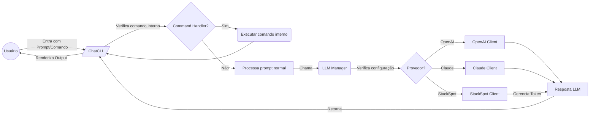

# ChatCLI - Arquitetura

## 1. Visão Geral do Funcionamento

- **ChatCLI** é uma aplicação de linha de comando (CLI) que interage com diversos modelos de linguagem (LLMs) — StackSpot, OpenAI e ClaudeAI.
- O usuário digita comandos ou mensagens diretamente no terminal, e as solicitações são enviadas para um dos provedores de LLM configurados.
- Há comandos especiais (`@history`, `@git`, `@env`, `@file`, `@command`, etc.) que adicionam contexto adicional ao prompt antes do envio para a IA.
- **Fluxo principal:**
    1. O usuário digita algo na CLI.
    2. O ChatCLI processa se é um comando especial (ex.: `@file`) ou um comando interno (`/exit`, `/switch` etc.).
    3. Envia-se a requisição ao LLM através de um cliente especializado (`OpenAIClient`, `StackSpotClient` ou `ClaudeClient`).
    4. Recebe-se a resposta e a exibe com formatação Markdown, possível animação de "pensando...", etc.

## 2. Estrutura de Pastas

```
chatcli/
│── cli/
│   ├── cli.go
│   ├── animation_manager.go
│   ├── command_handler.go
│   ├── command_handler_test.go
│   ├── history_manager.go
│
│── llm/
│   ├── openai/
│   ├── claudeai/
│   ├── stackspotai/
│   ├── manager/
│   ├── client/
│   ├── token/
│
│── config/
│
│── models/
│
│── utils/
│   ├── file_utils.go
│   ├── git_utils.go
│   ├── shell_utils.go
│   ├── logging_transport.go
│   ├── http_client.go
│   ├── path.go
│   ├── utils.go
│
│── main.go
```

### 2.1 **Descrição das Pastas**

#### `cli/` - Interface de Linha de Comando
- `cli.go`: Classe principal ChatCLI que gerencia o loop de entrada de usuário, animações e chamadas para LLMs.
- `animation_manager.go`: Gerencia a animação de “Pensando…” usando goroutines.
- `command_handler.go`: Processa os comandos `/exit`, `/switch`, `/reload` e direciona a execução.
- `history_manager.go`: Gerencia o arquivo `.chatcli_history`, salva e carrega o histórico entre sessões.

#### `llm/` - Camada de Abstração dos Modelos de Linguagem
- **Subpastas:** `openai/`, `claudeai/`, `stackspotai/` → Cada uma com sua implementação de cliente.
- `manager/`: Gerencia qual cliente LLM será usado.
- `client/`: Interface `LLMClient` e mocks para testes.
- `token/`: Gerencia tokens de acesso (por exemplo, StackSpot ou OAuth).

#### `config/` - Configuração
- Armazena valores padrão, como modelos default, URLs de API, tamanhos máximos de log ou histórico.

#### `models/` - Modelos de Dados
- `Message`: Representa mensagens trocadas.
- `ResponseData`: Status e resposta.

#### `utils/` - Funções Utilitárias
- `file_utils.go`: Manipulação de arquivos.
- `git_utils.go`: Interação com Git.
- `shell_utils.go`: Histórico de shells (`bash`, `zsh`, `fish`).
- `logging_transport.go`: Logs de requests HTTP.
- `http_client.go`: Cliente HTTP customizado.
- `path.go`: Manipulação de caminhos.
- `utils.go`: Helpers diversos (`UUID`, carregamento de `.env`).

#### `main.go` - Ponto de Entrada
- Carrega `.env`, inicializa logger, verifica provedores e inicia a CLI.

## 3. Fluxo Lógico em Resumo

1. `main.go` carrega `.env` (se existir), configura o logger e checa variáveis essenciais (`CLIENT_ID`, `OPENAI_API_KEY`, etc.).
2. Cria-se o `LLMManager`, que define o provedor de IA (`OPENAI`, `STACKSPOT`, `CLAUDEAI`, etc.).
3. `ChatCLI` lê comandos em loop:
    - `/exit`: Sai.
    - `/switch`: Troca de provedor.
    - `/reload`: Recarrega `.env`.
    - `/help`: Exibe ajuda.
    - `@history`, `@env`, `@file`: Adicionam contexto ao prompt.
    - `@command`: Executa comandos no shell do usuário.
    - Caso contrário, envia a mensagem ao LLM e exibe a resposta.
4. Histórico de inputs do usuário salvo em `.chatcli_history`.
5. Ao encerrar, faz um shutdown gracioso, fecha o logger e libera recursos.

## 4. Características de Desempenho e Arquitetura

### Uso de Goroutines
- `AnimationManager`: roda animações em paralelo sem bloquear requisições.
- `@file`: usa `workers` (4 goroutines) para leitura simultânea de arquivos.

### Tolerância a Falhas e Retry
- `OpenAIClient`, `ClaudeClient`, `StackSpotClient`: Implementam **retry** com **backoff exponencial**.

### Compatibilidade com Shells
- Suporte para `bash`, `zsh`, `fish`.

### Logging Extensivo
- `LoggingTransport`: registra requisições HTTP (sanitiza tokens/senhas).
- **Rotação de logs** configurável via `lumberjack`.

### Configurações via ENV
- Tudo é configurável por variáveis de ambiente (`provedores`, `modelo`, `chave de API`, etc.).

## 5. Possíveis Melhorias

- **Uso intensivo de variáveis de ambiente**: Pode ser refinado para maior segurança em produção.
- **Granularidade de retry**: Configurar melhor a estratégia de re-tentativa por tipo de erro.
- **Testes mais robustos**: Expandir mocks e adicionar testes de integração.
- **Histórico persistente**: Implementar uma forma de salvar conversas de forma mais estruturada.
- **Gerenciamento de arquivos**: Melhorar eficiência na leitura de arquivos grandes.

## 6. Conclusão

- `cli/` gerencia a **interface de linha de comando**.
- `llm/` abstrai múltiplos **provedores de IA**.
- `utils/` contém **funções auxiliares**.
- **Configuração** baseada em `.env`, com **suporte a múltiplos shells** e **execução de comandos nativa**.
- **Extensível**, **leve** e com **boas práticas de desenvolvimento** aplicadas.

🚀 **ChatCLI oferece uma experiência fluida para acessar LLMs diretamente do terminal!**

