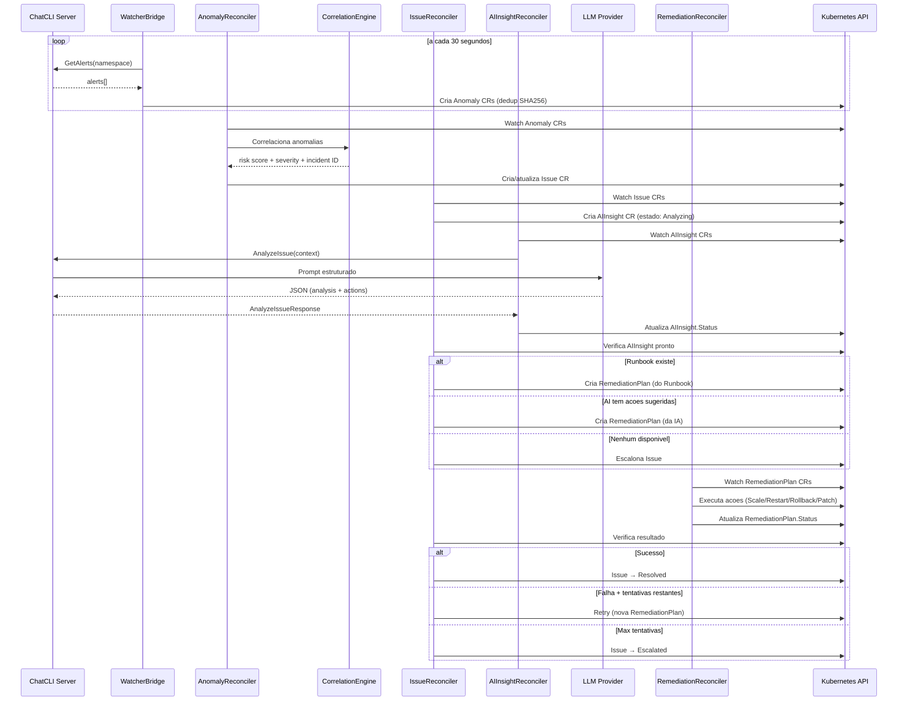
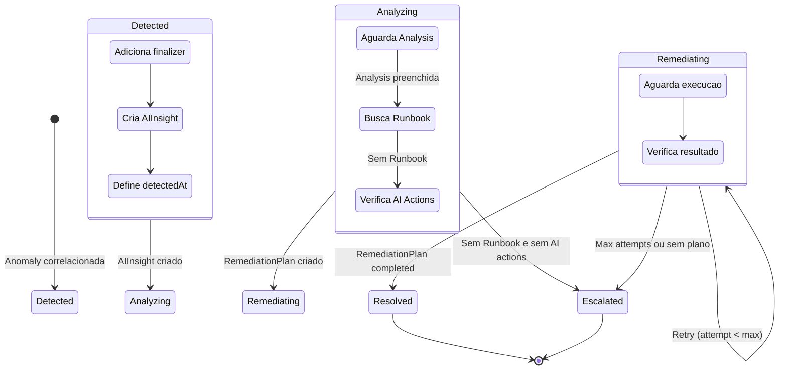
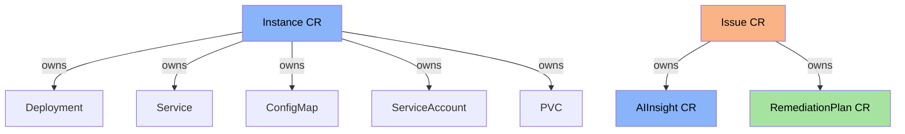

+++
title = "AIOps Platform (Deep-Dive)"
linkTitle = "AIOps Platform"
weight = 64
description = "Arquitetura detalhada da plataforma AIOps autonoma: pipeline completo de deteccao, correlacao, analise por IA e remediacao automatica no Kubernetes."
icon = "psychology"
+++

A **Plataforma AIOps** do ChatCLI e um sistema autonomo que detecta problemas no Kubernetes, analisa causas raiz com IA e executa remediacoes automaticas — tudo orquestrado por CRDs nativos do Kubernetes.

Esta pagina cobre a arquitetura interna em profundidade. Para configuracao e exemplos de uso, veja [K8s Operator](/docs/features/k8s-operator/).

---

## Visao Geral do Pipeline



---

## Componentes Internos

### 1. WatcherBridge (`watcher_bridge.go`)

O WatcherBridge e o ponto de entrada do pipeline. Implementa a interface `manager.Runnable` do controller-runtime e roda como goroutine gerenciada pelo manager.

**Responsabilidades:**

| Funcao | Descricao |
|--------|-----------|
| `Start()` | Inicia o loop de polling (30s) com context cancelavel |
| `poll()` | Consulta GetAlerts e cria Anomaly CRs |
| `discoverAndConnect()` | Descobre servidor via Instance CRs no cluster |
| `createAnomaly()` | Converte alert → Anomaly CR com owner references |
| `alertHash()` | SHA256 com bucket de minuto para dedup |
| `sanitizeK8sName()` | Garante nomes validos para objetos K8s (63 chars, lowercase, sem caracteres especiais) |

**Dedup por SHA256:**

```
hash = SHA256(alertType + deployment + namespace + message + minuteBucket)
```

- **Bucket de minuto**: `timestamp / 60` — alertas dentro do mesmo minuto geram o mesmo hash
- **TTL**: 2 horas — hashes expirados sao podados automaticamente
- **Resultado**: Mesmo alerta repetido no mesmo minuto nao gera duplicatas

**Descoberta do Servidor:**

```
1. Lista Instance CRs no cluster
2. Seleciona o primeiro Instance com Status.Ready=true
3. Conecta via gRPC insecure (10s timeout)
4. Se conexao falha, tenta novamente no proximo ciclo de poll
```

### 2. AnomalyReconciler (`anomaly_controller.go`)

Observa Anomaly CRs e os correlaciona em Issues.

**Fluxo:**

1. Recebe Anomaly CR recem-criado (`Status.Correlated = false`)
2. Chama `CorrelationEngine.FindRelatedAnomalies()` para agrupar
3. Calcula risk score e severidade
4. Cria ou atualiza Issue CR correspondente
5. Marca Anomaly como `Correlated = true` com referencia ao Issue

### 3. CorrelationEngine (`correlation.go`)

Motor de correlacao que agrupa anomalias em incidentes.

**Algoritmo de Correlacao:**

```
Para cada nova anomalia:
  1. Gera incident_id = hash(resource_kind + resource_name + namespace + signal_type)
  2. Busca Issue existente com mesmo incident_id
  3. Se existe → adiciona anomalia ao Issue, recalcula risk score
  4. Se nao existe → cria novo Issue
```

**Risk Scoring:**

| Sinal | Peso | Justificativa |
|-------|------|---------------|
| `oom_kill` | 30 | Indica problema de memoria severo |
| `error_rate` | 25 | Impacto direto em usuarios |
| `deploy_failing` | 25 | Indisponibilidade do servico |
| `latency_spike` | 20 | Degradacao de performance |
| `pod_restart` | 20 | Instabilidade do pod |
| `pod_not_ready` | 20 | Capacidade reduzida |

**Classificacao de Severidade:**

```
risk_score >= 80 → Critical
risk_score >= 60 → High
risk_score >= 40 → Medium
risk_score <  40 → Low
```

**Exemplo**: Um deployment com `oom_kill` (30) + `pod_restart` (20) = risk 50 → **Medium**. Se adicionar `error_rate` (25) = risk 75 → **High**.

**Mapeamento de Fonte:**

| Anomaly Source | Issue Source |
|---------------|-------------|
| `watcher` | `watcher` |
| `prometheus` | `prometheus` |
| `manual` | `manual` |

### 4. IssueReconciler (`issue_controller.go`)

Gerencia o ciclo de vida completo de um Issue atraves de uma maquina de estados.

**Estados e Transicoes:**



**handleDetected():**
1. Define `detectedAt` e `maxRemediationAttempts` (padrao: 3)
2. Cria AIInsight CR com owner reference (Issue → AIInsight)
3. Transiciona para `Analyzing`
4. Requeue apos 10 segundos

**handleAnalyzing():**
1. Verifica se AIInsight tem `Analysis` preenchida
2. Busca Runbook correspondente (`findMatchingRunbook`)
3. Se encontrou Runbook → `createRemediationPlan()`
4. Se nao encontrou Runbook mas AIInsight tem `SuggestedActions` → `createRemediationPlanFromAI()`
5. Se nenhum → escalona com razao `NoRunbookOrAIActions`
6. Transiciona para `Remediating`

**handleRemediating():**
1. Busca RemediationPlan mais recente (`findLatestRemediationPlan`)
2. Se `Completed` → Issue `Resolved`
3. Se `Failed` e tentativas restantes → cria novo RemediationPlan (retry)
4. Se `Failed` e max tentativas → `Escalated`

**Prioridade de Remediacao (handleAnalyzing e retry):**

```
1. Runbook existente (match por signalType + severity + resourceKind)
2. AI SuggestedActions (fallback automatico)
3. Escalonamento (ultimo recurso)
```

### 5. AIInsightReconciler (`aiinsight_controller.go`)

Observa AIInsight CRs e chama o `AnalyzeIssue` RPC para preencher a analise.

**Fluxo:**

1. Verifica se `Status.Analysis` ja esta preenchida (skip se sim)
2. Verifica se servidor esta conectado (requeue 15s se nao)
3. Busca Issue pai para contexto
4. Monta `AnalyzeIssueRequest` com todos os dados do Issue
5. Chama `AnalyzeIssue` RPC via `ServerClient`
6. Preenche `Status.Analysis`, `Confidence`, `Recommendations`, `SuggestedActions`

**AnalyzeIssueRequest:**

| Campo | Origem | Descricao |
|-------|--------|-----------|
| `issue_name` | Issue.Name | Nome do Issue |
| `namespace` | Issue.Namespace | Namespace |
| `resource_kind` | Issue.Spec.Resource.Kind | Tipo do recurso (Deployment) |
| `resource_name` | Issue.Spec.Resource.Name | Nome do deployment |
| `signal_type` | Issue labels | Tipo do sinal |
| `severity` | Issue.Spec.Severity | Severidade |
| `description` | Issue.Spec.Description | Descricao do problema |
| `risk_score` | Issue.Spec.RiskScore | Score de risco |
| `provider` | AIInsight.Spec.Provider | Provedor LLM |
| `model` | AIInsight.Spec.Model | Modelo LLM |

### 6. RemediationReconciler (`remediation_controller.go`)

Executa as acoes definidas em um RemediationPlan.

**Acoes Suportadas:**

| Tipo | O que Faz | Parametros |
|------|-----------|-----------|
| `ScaleDeployment` | `kubectl scale deployment/<name> --replicas=N` | `replicas` (obrigatorio) |
| `RestartDeployment` | `kubectl rollout restart deployment/<name>` | — |
| `RollbackDeployment` | `kubectl rollout undo deployment/<name>` | — |
| `PatchConfig` | Atualiza chave(s) em um ConfigMap | `configmap`, `key=value` |
| `Custom` | **Bloqueado** — requer aprovacao manual | — |

**Safety Checks:**
- Acoes `Custom` sao bloqueadas e o plan e marcado como `Failed`
- Safety constraints sao registradas no spec mas nao executadas programaticamente (futuro: OPA/Gatekeeper integration)

**Fluxo de Execucao:**

```
Pending → Executing → (executa todas as acoes sequencialmente) → Completed | Failed
```

### 7. ServerClient (`grpc_client.go`)

Cliente gRPC compartilhado entre WatcherBridge e AIInsightReconciler.

| Metodo | Descricao |
|--------|-----------|
| `NewServerClient()` | Cria instancia (sem conexao) |
| `Connect(addr)` | Conecta via gRPC insecure (10s timeout) |
| `GetAlerts(namespace)` | Busca alertas do watcher |
| `AnalyzeIssue(req)` | Envia issue para analise por IA |
| `IsConnected()` | Verifica se conexao esta ativa |
| `Close()` | Fecha conexao gRPC |

---

## Interacao Server ↔ Operator

### GetAlerts RPC

O servidor expoe os alertas do K8s Watcher via gRPC:

```protobuf
rpc GetAlerts(GetAlertsRequest) returns (GetAlertsResponse);

message AlertInfo {
  string alert_type = 1;    // HighRestartCount, OOMKilled, PodNotReady, DeploymentFailing
  string deployment = 2;
  string namespace = 3;
  string message = 4;
  string severity = 5;
  int64 timestamp = 6;
}
```

O handler no servidor itera sobre os `ObservabilityStore` de cada target do MultiWatcher, filtra por namespace se especificado, e retorna alertas ativos.

### AnalyzeIssue RPC

O servidor recebe o contexto do Issue e chama o LLM para analise:

```protobuf
rpc AnalyzeIssue(AnalyzeIssueRequest) returns (AnalyzeIssueResponse);

message SuggestedAction {
  string name = 1;
  string action = 2;
  string description = 3;
  map<string, string> params = 4;
}

message AnalyzeIssueResponse {
  string analysis = 1;
  float confidence = 2;
  repeated string recommendations = 3;
  string provider = 4;
  string model = 5;
  repeated SuggestedAction suggested_actions = 6;
}
```

**Prompt Estruturado:**

O servidor constroi um prompt que inclui:

1. Contexto do Issue (nome, namespace, recurso, severidade, risk score, descricao)
2. Lista de acoes disponiveis (`ScaleDeployment`, `RestartDeployment`, `RollbackDeployment`, `PatchConfig`)
3. Instrucoes para retornar JSON estruturado com campos `analysis`, `confidence`, `recommendations` e `actions`

**Parsing da Resposta:**

1. Remove markdown codeblocks (`` ```json ... ``` ``)
2. Parseia JSON em `analysisResult`
3. Clamp confidence entre 0.0 e 1.0
4. Se parsing falhar → usa resposta raw como analysis com confidence 0.5

---

## Prometheus Metrics do Operator

O operator expoe metricas Prometheus para observabilidade:

| Metrica | Tipo | Descricao |
|---------|------|-----------|
| `chatcli_operator_issues_total` | Counter | Total de issues por severidade e estado |
| `chatcli_operator_issue_resolution_duration_seconds` | Histogram | Duracao da deteccao ate resolucao |
| `chatcli_operator_active_issues` | Gauge | Numero de issues nao resolvidos |

---

## Testes

O operator possui 86 testes (115 com subtests) cobrindo todos os componentes:

| Componente | Testes | Cobertura |
|-----------|--------|-----------|
| InstanceReconciler | 15 | CRUD, watcher, persistence, replicas, RBAC, deletion, deepcopy |
| AnomalyReconciler | 4 | Criacao, correlacao, attachment a Issue existente |
| IssueReconciler | 10 | Maquina de estados completa, fallback AI, retry, escalonamento |
| RemediationReconciler | 10 | Todos os tipos de acao, safety checks, bloqueio de Custom |
| AIInsightReconciler | 12 | Conectividade, mock RPC, parsing de analise, withAuth, TLS/token |
| WatcherBridge | 22 | Mapeamento de alertas, dedup SHA256, hash, pruning, criacao de Anomaly, buildConnectionOpts (TLS, token, ambos) |
| CorrelationEngine | 4 | Risk scoring, severidade, incident ID, anomalias relacionadas |
| Pipeline (E2E) | 3 | Fluxo completo: Anomaly→Issue→Insight→Plan→Resolved, escalonamento, correlacao |
| MapActionType | 6 | Todos os mapeamentos string→enum |

### Executar Testes

```bash
cd operator
go test ./... -v
```

---

## Diagrama de Ownership (Garbage Collection)



- **Instance** e owner de todos os recursos Kubernetes que cria (Deployment, Service, ConfigMap, SA, PVC)
- **Issue** e owner de AIInsight e RemediationPlan (cascade delete)
- Anomalies sao independentes (nao tem owner) para preservar historico

---

## Checklist de Implantacao AIOps

- [ ] Instalar todos os CRDs: `kubectl apply -f operator/config/crd/bases/`
- [ ] Instalar RBAC do operator: `kubectl apply -f operator/config/rbac/role.yaml`
- [ ] Deployar o operator: `kubectl apply -f operator/config/manager/manager.yaml`
- [ ] Criar Secret com API keys do provedor LLM
- [ ] Criar Instance CR com `watcher.enabled: true` e targets configurados
- [ ] Verificar que o servidor ChatCLI esta rodando (`kubectl get instances`)
- [ ] Verificar que anomalias estao sendo detectadas (`kubectl get anomalies -A`)
- [ ] Verificar que issues estao sendo criados (`kubectl get issues -A`)
- [ ] Verificar que a IA esta analisando (`kubectl get aiinsights -A`)
- [ ] (Opcional) Criar Runbooks manuais para cenarios especificos
- [ ] Monitorar metricas do operator via Prometheus

---

## Proximo Passo

- [K8s Operator (configuracao e exemplos)](/docs/features/k8s-operator/)
- [K8s Watcher (detalhes de coleta e budget)](/docs/features/k8s-watcher/)
- [Modo Servidor (RPCs GetAlerts e AnalyzeIssue)](/docs/features/server-mode/)
- [Receita: Monitoramento K8s com IA](/docs/cookbook/k8s-monitoring/)
