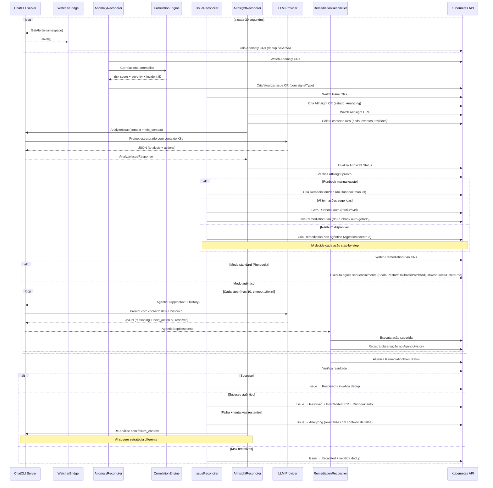
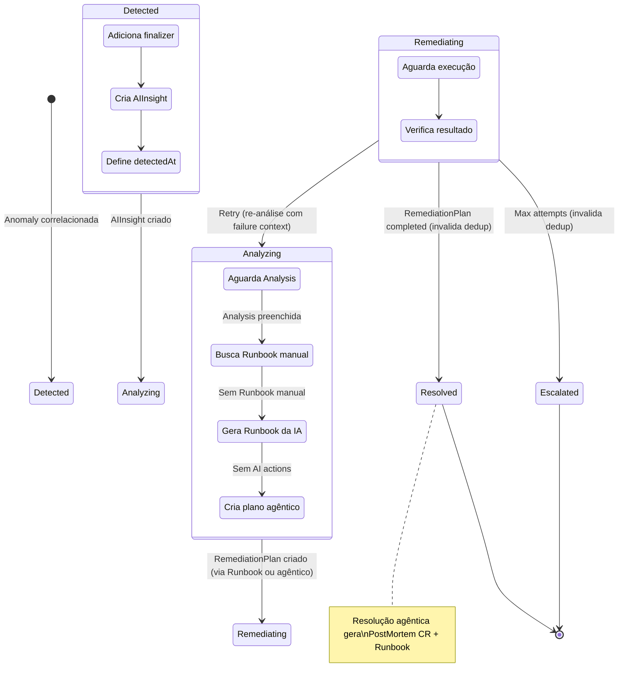
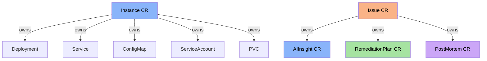

+++
title = "AIOps Platform (Deep-Dive)"
linkTitle = "AIOps Platform"
weight = 64
description = "Arquitetura detalhada da plataforma AIOps autônoma: pipeline completo de detecção, correlação, análise por IA e remediação automática no Kubernetes."
icon = "psychology"
+++

A **Plataforma AIOps** do ChatCLI e um sistema autônomo que detecta problemas no Kubernetes, analisa causas raiz com IA e executa remediações automáticas — tudo orquestrado por CRDs nativos do Kubernetes.

Esta página cobre a arquitetura interna em profundidade. Para configuração e exemplos de uso, veja [K8s Operator](/docs/features/k8s-operator/).

---

## Visão Geral do Pipeline



---

## Componentes Internos

### 1. WatcherBridge (`watcher_bridge.go`)

O WatcherBridge e o ponto de entrada do pipeline. Implementa a interface `manager.Runnable` do controller-runtime e roda como goroutine gerenciada pelo manager.

**Responsabilidades:**

| Função | Descrição |
|--------|-----------|
| `Start()` | Inicia o loop de polling (30s) com context cancelavel |
| `poll()` | Consulta GetAlerts e cria Anomaly CRs |
| `discoverAndConnect()` | Descobre servidor via Instance CRs no cluster |
| `createAnomaly()` | Converte alert → Anomaly CR com labels de referência |
| `alertHash()` | SHA256(type\|deployment\|namespace) para dedup |
| `InvalidateDedupForResource()` | Remove entradas de dedup para um deployment+namespace |
| `sanitizeK8sName()` | Garante nomes válidos para objetos K8s (63 chars, lowercase, sem caracteres especiais) |

**Dedup por SHA256:**

```
hash = SHA256(alertType | deployment | namespace)
```

- **Sem componente temporal**: Um problema contínuo (e.g. CrashLoopBackOff) gera apenas uma Anomaly
- **TTL**: 2 horas — hashes expirados são podados automaticamente
- **Invalidação**: Quando um Issue atinge estado terminal (Resolved/Escalated), as entradas de dedup para o recurso afetado são invalidadas, permitindo detecção imediata de recorrências
- **Resultado**: Evita duplicatas durante problema ativo; detecta recorrência após resolução

**Descoberta do Servidor:**

```
1. Lista Instance CRs no cluster
2. Seleciona o primeiro Instance com Status.Ready=true
3. Conecta via gRPC insecure (10s timeout)
4. Se conexão falha, tenta novamente no próximo ciclo de poll
```

### 2. AnomalyReconciler (`anomaly_controller.go`)

Observa Anomaly CRs e os correlaciona em Issues.

**Fluxo:**

1. Recebe Anomaly CR recém-criado (`Status.Correlated = false`)
2. Chama `CorrelationEngine.FindRelatedAnomalies()` para agrupar
3. Calcula risk score e severidade
4. Cria ou atualiza Issue CR correspondente
5. Marca Anomaly como `Correlated = true` com referencia ao Issue

### 3. CorrelationEngine (`correlation.go`)

Motor de correlação que agrupa anomalias em incidentes.

**Algoritmo de Correlação:**

```
Para cada nova anomalia:
  1. Gera incident_id = hash(resource_kind + resource_name + namespace + signal_type)
  2. Busca Issue existente com mesmo incident_id
  3. Se existe → adiciona anomalia ao Issue, recalcula risk score
  4. Se não existe → cria novo Issue
```

**Risk Scoring:**

| Sinal | Peso | Justificativa |
|-------|------|---------------|
| `oom_kill` | 30 | Indica problema de memória severo |
| `error_rate` | 25 | Impacto direto em usuários |
| `deploy_failing` | 25 | Indisponibilidade do serviço |
| `latency_spike` | 20 | Degradação de performance |
| `pod_restart` | 20 | Instabilidade do pod |
| `pod_not_ready` | 20 | Capacidade reduzida |

**Classificação de Severidade:**

```
risk_score >= 80 → Critical
risk_score >= 60 → High
risk_score >= 40 → Medium
risk_score <  40 → Low
```

**Exemplo**: Um deployment com `oom_kill` (30) + `pod_restart` (20) = risk 50 → **Medium**. Se adicionar `error_rate` (25) = risk 75 → **High**.

**Mapeamento de Fonte:**

| Anomaly Source | Issue Source |
|---------------|-------------|
| `watcher` | `watcher` |
| `prometheus` | `prometheus` |
| `manual` | `manual` |

### 4. IssueReconciler (`issue_controller.go`)

Gerencia o ciclo de vida completo de um Issue através de uma máquina de estados.

**Estados e Transições:**



**handleDetected():**
1. Define `detectedAt` e `maxRemediationAttempts` (padrão: 3)
2. Cria AIInsight CR com owner reference (Issue → AIInsight)
3. Transiciona para `Analyzing`
4. Requeue após 10 segundos

**handleAnalyzing():**
1. Verifica se AIInsight tem `Analysis` preenchida
2. Busca Runbook manual correspondente (`findMatchingRunbook` — tiered matching)
3. Se encontrou Runbook manual → `createRemediationPlan()` (manual tem precedência)
4. Se não encontrou Runbook manual mas AIInsight tem `SuggestedActions` → `generateRunbookFromAI()` → `createRemediationPlan()` usando o Runbook auto-gerado
5. Se nenhum → `createAgenticRemediationPlan()` (AgenticMode=true, sem ações pré-definidas — a IA decide cada passo)
6. Transiciona para `Remediating`

**`findMatchingRunbook()` — Matching em camadas:**
- **Tier 1**: SignalType + Severity + ResourceKind (match exato, preferido)
- **Tier 2**: Severity + ResourceKind (fallback quando signal não bate)
- `SignalType` resolvido de: `issue.Spec.SignalType` → fallback `issue.Labels["platform.chatcli.io/signal"]`

**`generateRunbookFromAI()`:**
- Materializa `SuggestedActions` do AI como Runbook CR reutilizável
- Nome: `auto-{signal}-{severity}-{kind}` (sanitizado)
- Labels: `platform.chatcli.io/auto-generated=true`
- Trigger: SignalType + Severity + ResourceKind (para reutilização futura)
- Usa `CreateOrUpdate` para idempotência

**handleRemediating():**
1. Busca RemediationPlan mais recente (`findLatestRemediationPlan`)
2. Se `Completed` → Issue `Resolved` + invalida dedup do recurso
   - Se plano agêntico: gera **PostMortem CR** (timeline, causa raiz, impacto, lições) + **Runbook reutilizável** dos passos bem-sucedidos
3. Se `Failed` e tentativas restantes → **re-análise**: coleta evidência de falha (`collectFailureEvidence`), limpa análise do AIInsight, volta para estado `Analyzing` com failure context
4. Se `Failed` e max tentativas → `Escalated` + invalida dedup do recurso

**Retry com Escalação de Estratégia:**
- Cada retry dispara re-análise do AI com contexto de falhas anteriores
- O AI recebe `previous_failure_context` com evidência das tentativas que falharam
- O prompt instrui: "Não repita as mesmas ações. Analise por que falharam e sugira uma abordagem fundamentalmente diferente"
- Gera novo Runbook auto-gerado com estratégia diferente (nome inclui attempt)

**Prioridade de Remediação:**

```
1. Runbook manual existente (match tiered: SignalType+Severity+Kind → Severity+Kind)
2. Runbook auto-gerado pela IA (materializado como CR reutilizável)
3. Escalonamento (último recurso)
```

### 5. AIInsightReconciler (`aiinsight_controller.go`)

Observa AIInsight CRs e chama o `AnalyzeIssue` RPC para preencher a análise.

**Fluxo:**

1. Verifica se `Status.Analysis` já está preenchida (skip se sim)
2. Verifica se servidor está conectado (requeue 15s se não)
3. Busca Issue pai para contexto
4. Coleta contexto K8s via `KubernetesContextBuilder` (deployment, pods, eventos, revisões)
5. Lê failure context de annotation `platform.chatcli.io/failure-context` (se re-análise)
6. Monta `AnalyzeIssueRequest` com dados do Issue + contexto K8s + failure context
7. Chama `AnalyzeIssue` RPC via `ServerClient`
8. Preenche `Status.Analysis`, `Confidence`, `Recommendations`, `SuggestedActions`
9. Limpa annotation `failure-context` após re-análise concluída

**KubernetesContextBuilder (`k8s_context.go`):**

Coleta 4 seções de contexto real do cluster (max 8000 chars):
- **Deployment Status**: replicas (desired/ready/updated/unavailable), conditions, container images + resources
- **Pod Details** (até 5 pods, unhealthy primeiro): phase, restart count, container states (Waiting/Terminated com reason + exit code)
- **Recent Events** (últimos 15): tipo, reason, message, count
- **Revision History**: Últimas 5 revisões (ReplicaSets) com diff de imagens entre revisões

**AnalyzeIssueRequest:**

| Campo | Origem | Descrição |
|-------|--------|-----------|
| `issue_name` | Issue.Name | Nome do Issue |
| `namespace` | Issue.Namespace | Namespace |
| `resource_kind` | Issue.Spec.Resource.Kind | Tipo do recurso (Deployment) |
| `resource_name` | Issue.Spec.Resource.Name | Nome do deployment |
| `signal_type` | Issue.Spec.SignalType / labels | Tipo do sinal |
| `severity` | Issue.Spec.Severity | Severidade |
| `description` | Issue.Spec.Description | Descrição do problema |
| `risk_score` | Issue.Spec.RiskScore | Score de risco |
| `provider` | AIInsight.Spec.Provider | Provedor LLM |
| `model` | AIInsight.Spec.Model | Modelo LLM |
| `kubernetes_context` | KubernetesContextBuilder | Status do deployment, pods, eventos, revisões |
| `previous_failure_context` | Annotation no AIInsight | Evidência de tentativas anteriores (retries) |

### 6. RemediationReconciler (`remediation_controller.go`)

Executa as ações definidas em um RemediationPlan.

**Ações Suportadas:**

| Tipo | O que Faz | Parâmetros |
|------|-----------|-----------|
| `ScaleDeployment` | `kubectl scale deployment/<name> --replicas=N` | `replicas` (obrigatório) |
| `RestartDeployment` | `kubectl rollout restart deployment/<name>` | — |
| `RollbackDeployment` | Rollback para revisão anterior, saudável ou específica | `toRevision` (optional: `previous`, `healthy`, número) |
| `PatchConfig` | Atualiza chave(s) em um ConfigMap | `configmap`, `key=value` |
| `AdjustResources` | Ajusta CPU/memória requests/limits | `memory_limit`, `memory_request`, `cpu_limit`, `cpu_request`, `container` |
| `DeletePod` | Remove o pod mais doente (CrashLoop > restarts) | `pod` (optional — auto-seleciona) |
| `Custom` | **Bloqueado** — requer aprovação manual | — |

**Safety Checks:**
- Scale to 0 replicas é bloqueado
- AdjustResources: limit não pode ser menor que request
- DeletePod: recusa deletar se só existe 1 pod (evita outage total)
- Custom actions são bloqueadas
- Pre-flight snapshot registra estado anterior para referência

**Fluxo de Execução (Standard):**

```
Pending → Executing → (executa ações sequencialmente) → Verifying → Completed | Failed
```

**Fluxo de Execução (Agentic):**

```
Pending → Executing → (loop agêntico: AI decide → executa → observa → repeat)
  → Verifying → Completed | Failed

Cada reconcile = 1 step do loop agêntico:
  1. Refresh contexto K8s (KubernetesContextBuilder)
  2. Envia histórico + contexto → AgenticStep RPC
  3. AI responde: {reasoning, resolved, next_action}
  4. Se resolved=true → Verifying (+ annotations com dados do PostMortem)
  5. Se next_action → executa → registra observação → requeue 5s
  6. Se observation-only → registra → requeue 10s
  Safety: max 10 steps, timeout 10 minutos
```

### 7. ServerClient (`grpc_client.go`)

Cliente gRPC compartilhado entre WatcherBridge e AIInsightReconciler.

| Metodo | Descrição |
|--------|-----------|
| `NewServerClient()` | Cria instância (sem conexão) |
| `Connect(addr)` | Conecta via gRPC insecure (10s timeout) |
| `GetAlerts(namespace)` | Busca alertas do watcher |
| `AnalyzeIssue(req)` | Envia issue para análise por IA |
| `AgenticStep(req)` | Executa um passo do loop agêntico (context + history → next action) |
| `IsConnected()` | Verifica se conexão está ativa |
| `Close()` | Fecha conexão gRPC |

---

## Interação Server ↔ Operator

### GetAlerts RPC

O servidor expoe os alertas do K8s Watcher via gRPC:

```protobuf
rpc GetAlerts(GetAlertsRequest) returns (GetAlertsResponse);

message AlertInfo {
  string alert_type = 1;    // HighRestartCount, OOMKilled, PodNotReady, DeploymentFailing
  string deployment = 2;
  string namespace = 3;
  string message = 4;
  string severity = 5;
  int64 timestamp = 6;
}
```

O handler no servidor itera sobre os `ObservabilityStore` de cada target do MultiWatcher, filtra por namespace se específicado, e retorna alertas ativos.

### AnalyzeIssue RPC

O servidor recebe o contexto do Issue e chama o LLM para análise:

```protobuf
rpc AnalyzeIssue(AnalyzeIssueRequest) returns (AnalyzeIssueResponse);

message SuggestedAction {
  string name = 1;
  string action = 2;
  string description = 3;
  map<string, string> params = 4;
}

message AnalyzeIssueResponse {
  string analysis = 1;
  float confidence = 2;
  repeated string recommendations = 3;
  string provider = 4;
  string model = 5;
  repeated SuggestedAction suggested_actions = 6;
}
```

**Prompt Estruturado:**

O servidor constroi um prompt que inclui:

1. Contexto do Issue (nome, namespace, recurso, severidade, risk score, descrição)
2. Lista de ações disponíveis (`ScaleDeployment`, `RestartDeployment`, `RollbackDeployment`, `PatchConfig`)
3. Instruções para retornar JSON estruturado com campos `analysis`, `confidence`, `recommendations` e `actions`

**Parsing da Resposta:**

1. Remove markdown codeblocks (`` ```json ... ``` ``)
2. Parseia JSON em `analysisResult`
3. Clamp confidence entre 0.0 e 1.0
4. Se parsing falhar → usa resposta raw como analysis com confidence 0.5

### AgenticStep RPC

O servidor recebe o contexto do Issue, histórico de passos anteriores e contexto K8s atualizado, e decide a próxima ação:

```protobuf
rpc AgenticStep(AgenticStepRequest) returns (AgenticStepResponse);

message AgenticStepRequest {
  string issue_name = 1;
  string namespace = 2;
  string resource_kind = 3;
  string resource_name = 4;
  string signal_type = 5;
  string severity = 6;
  string description = 7;
  int32 risk_score = 8;
  string provider = 9;
  string model = 10;
  string kubernetes_context = 11;   // refreshado a cada step
  repeated AgenticHistoryEntry history = 12;
  int32 max_steps = 13;
  int32 current_step = 14;
}

message AgenticStepResponse {
  string reasoning = 1;              // raciocínio da IA (registrado no histórico)
  bool resolved = 2;                 // true = problema resolvido
  SuggestedAction next_action = 3;   // null quando resolved=true
  // Campos abaixo só populados quando resolved=true:
  string postmortem_summary = 4;
  string root_cause = 5;
  string impact = 6;
  repeated string lessons_learned = 7;
  repeated string prevention_actions = 8;
}
```

**Prompt do AgenticStep:**

O servidor constrói um prompt estruturado com:

1. **Role + Issue details**: contexto do incidente (tipo, severidade, recurso)
2. **Kubernetes context**: estado real do cluster (refreshado a cada step via KubernetesContextBuilder)
3. **Tool definitions**: 6 ações mutantes disponíveis + "Observe" (sem ação, espera próximo contexto)
4. **Conversation history**: cada step anterior formatado com reasoning → action → observation
5. **Instructions**: respond JSON, budget (step N of M), regras de segurança

Quando `resolved=true`, a resposta inclui dados para geração do PostMortem (summary, root_cause, impact, lessons_learned, prevention_actions).

---

## PostMortem Generation

Quando uma remediação agêntica resolve um Issue, o `IssueReconciler` gera automaticamente:

### PostMortem CR

Criado via `generatePostMortem()`:

| Campo | Origem |
|-------|--------|
| `timeline` | Issue.DetectedAt + cada step do AgenticHistory + resolved |
| `actionsExecuted` | Steps com Action != nil (inclui resultado) |
| `summary` | Annotation `platform.chatcli.io/postmortem-summary` (gerado pela IA) |
| `rootCause` | Annotation `platform.chatcli.io/root-cause` |
| `impact` | Annotation `platform.chatcli.io/impact` |
| `lessonsLearned` | Annotation `platform.chatcli.io/lessons-learned` |
| `preventionActions` | Annotation `platform.chatcli.io/prevention-actions` |
| `duration` | Calculado: resolvedAt - detectedAt |

O PostMortem CR é owned pelo Issue (cascade delete).

### Runbook Auto-gerado (Agentic)

Criado via `generateAgenticRunbook()`:

- **Nome**: `agentic-{signal}-{severity}-{kind}` (sanitizado)
- **Steps**: apenas os passos com ação bem-sucedida
- **Labels**: `auto-generated=true`, `source=agentic`
- Usa `CreateOrUpdate` (reutilizado para incidentes futuros do mesmo tipo)

---

## Prometheus Metrics do Operator

O operator expoe métricas Prometheus para observabilidade:

| Metrica | Tipo | Descrição |
|---------|------|-----------|
| `chatcli_operator_issues_total` | Counter | Total de issues por severidade e estado |
| `chatcli_operator_issue_resolution_duration_seconds` | Histogram | Duração da detecção até resolução |
| `chatcli_operator_active_issues` | Gauge | Número de issues não resolvidos |

---

## Testes

O operator possui 96 testes (125 com subtests) cobrindo todos os componentes:

| Componente | Testes | Cobertura |
|-----------|--------|-----------|
| InstanceReconciler | 15 | CRUD, watcher, persistence, réplicas, RBAC, deletion, deepcopy |
| AnomalyReconciler | 4 | Criação, correlação, attachment a Issue existente |
| IssueReconciler | 12 | Máquina de estados, fallback AI, retry, plano agêntico, geração PostMortem |
| RemediationReconciler | 16 | Todos os tipos de ação, safety checks, loop agêntico (first step, resolved, max steps, timeout, action failed, observation) |
| AIInsightReconciler | 12 | Conectividade, mock RPC, parsing de análise, withAuth, TLS/token |
| PostMortemReconciler | 2 | Inicialização de estado, estado terminal |
| WatcherBridge | 22 | Mapeamento de alertas, dedup SHA256, hash, pruning, criação de Anomaly, buildConnectionOpts (TLS, token, ambos) |
| CorrelationEngine | 4 | Risk scoring, severidade, incident ID, anomalias relacionadas |
| Pipeline (E2E) | 3 | Fluxo completo: Anomaly→Issue→Insight→Plan→Resolved, escalonamento, correlação |
| MapActionType | 6 | Todos os mapeamentos string→enum |

### Executar Testes

```bash
cd operator
go test ./... -v
```

---

## Diagrama de Ownership (Garbage Collection)



- **Instance** e owner de todos os recursos Kubernetes que cria (Deployment, Service, ConfigMap, SA, PVC)
- **Issue** e owner de AIInsight, RemediationPlan e PostMortem (cascade delete)
- Anomalies são independentes (não tem owner) para preservar histórico

---

## Checklist de Implantação AIOps

- [ ] Instalar todos os CRDs: `kubectl apply -f operator/config/crd/bases/`
- [ ] Instalar RBAC do operator: `kubectl apply -f operator/config/rbac/role.yaml`
- [ ] Deployar o operator: `kubectl apply -f operator/config/manager/manager.yaml`
- [ ] Criar Secret com API keys do provedor LLM
- [ ] Criar Instance CR com `watcher.enabled: true` e targets configurados
- [ ] Verificar que o servidor ChatCLI está rodando (`kubectl get instances`)
- [ ] Verificar que anomalias estão sendo detectadas (`kubectl get anomalies -A`)
- [ ] Verificar que issues estão sendo criados (`kubectl get issues -A`)
- [ ] Verificar que a IA está analisando (`kubectl get aiinsights -A`)
- [ ] (Opcional) Criar Runbooks manuais para cenários específicos
- [ ] Monitorar métricas do operator via Prometheus

---

## Próximo Passo

- [K8s Operator (configuração e exemplos)](/docs/features/k8s-operator/)
- [K8s Watcher (detalhes de coleta e budget)](/docs/features/k8s-watcher/)
- [Modo Servidor (RPCs GetAlerts, AnalyzeIssue e AgenticStep)](/docs/features/server-mode/)
- [Receita: Monitoramento K8s com IA](/docs/cookbook/k8s-monitoring/)
