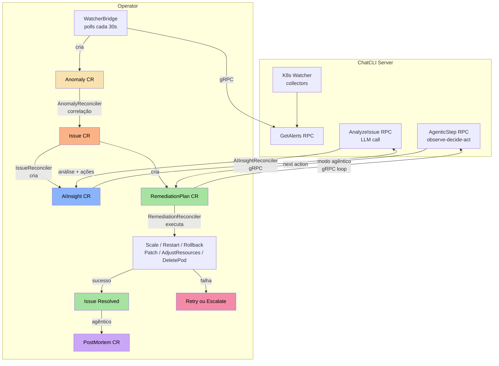
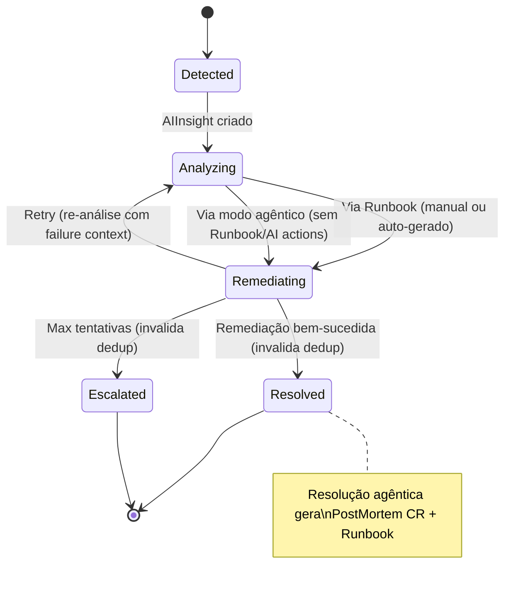

+++
title = "Kubernetes Operator (AIOps)"
linkTitle = "K8s Operator"
weight = 63
description = "Gerencie instâncias ChatCLI e uma plataforma AIOps autônoma no Kubernetes com 6 CRDs, correlação de anomalias, análise por IA e remediação automática."
icon = "deployed_code"
+++

O **ChatCLI Operator** vai além do gerenciamento de instâncias. Ele implementa uma **plataforma AIOps completa** que detecta anomalias autônomamente, correlaciona sinais, solicita análise de IA e executa remediação — tudo sem dependências externas além do provedor LLM.

---

## API Group e CRDs

O operator usa o API group `platform.chatcli.io/v1alpha1` com 7 Custom Resource Definitions:

| CRD | Short Name | Descrição |
|-----|-----------|-----------|
| **Instance** | `inst` | Instancia do servidor ChatCLI (Deployment, Service, RBAC, PVC) |
| **Anomaly** | `anom` | Sinal bruto do K8s Watcher (restarts, OOM, falhas de deploy) |
| **Issue** | `iss` | Incidente correlacionado agrupando múltiplas anomalias |
| **AIInsight** | `ai` | Análise de causa raiz gerada por IA com ações sugeridas |
| **RemediationPlan** | `rp` | Ações concretas para resolver o problema (runbook ou IA agêntica) |
| **Runbook** | `rb` | Procedimentos operacionais manuais (opcional) |
| **PostMortem** | `pm` | Relatório de incidente auto-gerado após resolução agêntica |

---

## Instalação do Operator

### Via Manifests

```bash
# Instalar todos os CRDs
kubectl apply -f operator/config/crd/bases/

# Instalar RBAC e Manager
kubectl apply -f operator/config/rbac/role.yaml
kubectl apply -f operator/config/manager/manager.yaml
```

### Via Docker Build

```bash
cd operator
make docker-build IMG=ghcr.io/diillson/chatcli-operator:latest
make docker-push IMG=ghcr.io/diillson/chatcli-operator:latest
```

---

## Arquitetura da Plataforma AIOps



### Pipeline Autônomo

| Fase | Componente | O que Faz |
|------|-----------|-----------|
| **1. Detecção** | WatcherBridge | Consulta `GetAlerts` do servidor a cada 30s. Cria Anomaly CRs (dedup SHA256). Invalida dedup quando Issue atinge estado terminal. |
| **2. Correlação** | AnomalyReconciler + CorrelationEngine | Agrupa anomalias por recurso + janela temporal. Calcula risk score e severidade. Cria/atualiza Issue CRs com `signalType`. |
| **3. Analise** | AIInsightReconciler + KubernetesContextBuilder | Coleta contexto K8s real (deployment, pods, eventos, revisões). Chama `AnalyzeIssue` RPC com contexto enriquecido. |
| **4. Remediação** | IssueReconciler | Runbook-first: **(a)** Runbook manual (tiered matching), **(b)** gera Runbook auto da IA, ou **(c)** remediação agêntica (IA atua step-by-step). |
| **5. Execução** | RemediationReconciler | Executa ações no cluster: ScaleDeployment, RestartDeployment, RollbackDeployment, PatchConfig, AdjustResources, DeletePod. Modo agêntico: IA decide cada ação via loop observe-decide-act. |
| **6. Resolução** | IssueReconciler | Sucesso → Resolved (invalida dedup). Falha → re-análise com contexto de falha (estratégia diferente) → até maxAttempts → Escalated. |
| **7. PostMortem** | IssueReconciler | Resolução agêntica → PostMortem CR auto-gerado (timeline, causa raiz, lições aprendidas) + Runbook reutilizável dos passos bem-sucedidos. |

### Máquina de Estados do Issue



---

## CRD: Instance

O `Instance` gerencia instâncias do servidor ChatCLI no cluster.

### Especificação Completa

```yaml
apiVersion: platform.chatcli.io/v1alpha1
kind: Instance
metadata:
  name: chatcli-prod
  namespace: chatcli          # O namespace deve existir antes de criar o Instance
spec:
  replicas: 1
  provider: CLAUDEAI       # OPENAI, CLAUDEAI, GOOGLEAI, XAI, STACKSPOT, OLLAMA
  model: claude-sonnet-4-5

  image:
    repository: ghcr.io/diillson/chatcli
    tag: latest
    pullPolicy: IfNotPresent

  server:
    port: 50051
    tls:
      enabled: true
      secretName: chatcli-tls
    token:
      name: chatcli-auth
      key: token

  watcher:
    enabled: true
    interval: "30s"
    window: "2h"
    maxLogLines: 100
    maxContextChars: 32000
    targets:
      - deployment: api-gateway
        namespace: production
        metricsPort: 9090
        metricsFilter: ["http_requests_*", "http_request_duration_*"]
      - deployment: auth-service
        namespace: production
        metricsPort: 9090
      - deployment: worker
        namespace: batch

  resources:
    requests:
      cpu: 100m
      memory: 128Mi
    limits:
      cpu: 500m
      memory: 512Mi

  persistence:
    enabled: true
    size: 1Gi
    storageClassName: standard

  securityContext:
    runAsNonRoot: true
    runAsUser: 1000
    seccompProfile:
      type: RuntimeDefault

  apiKeys:
    name: chatcli-api-keys
```

### Campos do Spec

#### Raiz

| Campo | Tipo | Obrigatório | Padrão | Descrição |
|-------|------|:-----------:|--------|-----------|
| `replicas` | int32 | Não | `1` | Número de réplicas do servidor |
| `provider` | string | **Sim** | | Provedor LLM |
| `model` | string | Não | | Modelo LLM |
| `image` | ImageSpec | Não | | Configuração da imagem |
| `server` | ServerSpec | Não | | Configuração do servidor gRPC |
| `watcher` | WatcherSpec | Não | | Configuração do K8s Watcher |
| `resources` | ResourceRequirements | Não | | Requests/limits de CPU e memória |
| `persistence` | PersistenceSpec | Não | | Persistência de sessões |
| `securityContext` | PodSecurityContext | Não | nonroot/1000 | Security context do pod |
| `apiKeys` | SecretRefSpec | Não | | Secret com API keys |

#### WatcherSpec

| Campo | Tipo | Obrigatório | Padrão | Descrição |
|-------|------|:-----------:|--------|-----------|
| `enabled` | bool | Não | `false` | Ativa o watcher |
| `targets` | []WatchTargetSpec | Não | | Lista de deployments (multi-target) |
| `deployment` | string | Não | | Deployment único (legado) |
| `namespace` | string | Não | | Namespace do deployment (legado) |
| `interval` | string | Não | `"30s"` | Intervalo de coleta |
| `window` | string | Não | `"2h"` | Janela de observação |
| `maxLogLines` | int32 | Não | `100` | Max linhas de log por pod |
| `maxContextChars` | int32 | Não | `32000` | Budget de contexto LLM |

#### WatchTargetSpec

| Campo | Tipo | Obrigatório | Padrão | Descrição |
|-------|------|:-----------:|--------|-----------|
| `deployment` | string | **Sim** | | Nome do deployment |
| `namespace` | string | **Sim** | | Namespace do deployment |
| `metricsPort` | int32 | Não | `0` | Porta Prometheus (0 = desabilitado) |
| `metricsPath` | string | Não | `/metrics` | Path do endpoint Prometheus |
| `metricsFilter` | []string | Não | | Filtros glob para métricas |

### Recursos Criados pelo Instance

| Recurso | Nome | Descrição |
|---------|------|-----------|
| **Deployment** | `<name>` | Pods do servidor ChatCLI |
| **Service** | `<name>` | Service gRPC (headless automático quando réplicas > 1 para LB client-side) |
| **ConfigMap** | `<name>` | Variáveis de ambiente (provider, model, etc.) |
| **ConfigMap** | `<name>-watch-config` | YAML multi-target (se `targets` definido) |
| **ServiceAccount** | `<name>` | Identity para RBAC |
| **Role/ClusterRole** | `<name>-watcher` | Permissões K8s do watcher |
| **RoleBinding/CRB** | `<name>-watcher` | Binding da SA ao Role |
| **PVC** | `<name>-sessions` | Persistência (se habilitada) |

### Balanceamento gRPC

O gRPC usa conexões HTTP/2 persistentes que fixam em um único pod via kube-proxy, deixando réplicas extras ociosas.

- **1 réplica** (padrão): Service ClusterIP padrão
- **Múltiplas réplicas**: Service headless (`ClusterIP: None`) é criado automaticamente, habilitando round-robin client-side via resolver `dns:///` do gRPC
- **Keepalive**: WatcherBridge faz ping a cada 30s (timeout de 5s) para detectar pods inativos rapidamente. O servidor aceita pings com intervalo mínimo de 20s (`EnforcementPolicy.MinTime`)
- **Transição**: Ao escalar de 1 para 2+ réplicas (ou voltar), o operator deleta e recria o Service automaticamente (ClusterIP é imutável no Kubernetes)

### RBAC Automático

- **Single-namespace** (todos os targets no mesmo namespace): Cria `Role` + `RoleBinding`
- **Multi-namespace** (targets em namespaces diferentes): Cria `ClusterRole` + `ClusterRoleBinding` automaticamente
- Na deleção do CR, cluster-scoped resources são limpos pelo finalizer

### Auto-Rollout em Mudanças de Configuração

O operator monitora mudanças em ConfigMaps e Secrets referenciados pelo Instance e dispara rolling updates automaticamente via hash annotations no PodTemplate:

| Annotation | Fonte | Quando Muda |
|------------|-------|-------------|
| `chatcli.io/watch-config-hash` | ConfigMap `<name>-watch-config` | Targets do watcher alterados |
| `chatcli.io/configmap-hash` | ConfigMap `<name>` | Variáveis de ambiente atualizadas |
| `chatcli.io/secret-hash` | Secret referenciado em `apiKeys.name` | API keys criadas ou atualizadas |
| `chatcli.io/tls-hash` | Secret referenciado em `server.tls.secretName` | Certificados TLS renovados |

Isso significa que:
- Adicionar/remover targets no `watcher.targets` e aplicar o Instance causa rollout automático
- Criar ou atualizar o Secret de API keys após o Instance já estar rodando causa rollout automático
- Renovar certificados TLS causa rollout automático

### Observação de Secrets e ConfigMaps

O operator observa (`Watches`) Secrets no namespace do Instance. Quando um Secret referenciado em `apiKeys.name` ou `server.tls.secretName` é criado ou atualizado, o reconciler é acionado automaticamente — mesmo que o Secret não existisse quando o Instance foi criado.

- **ConfigMap e Secret `envFrom`**: Marcados como `optional: true`, permitindo criar o Instance antes do Secret/ConfigMap
- **Ordem flexível de deploy**: Namespace → Instance → Secret/ConfigMap (qualquer ordem após o namespace)

---

## CRDs da Plataforma AIOps

### Anomaly

Representa um sinal bruto detectado pelo WatcherBridge.

```yaml
apiVersion: platform.chatcli.io/v1alpha1
kind: Anomaly
metadata:
  name: watcher-highrestartcount-api-gateway-1234567890
  namespace: production
spec:
  signalType: pod_restart    # pod_restart | oom_kill | pod_not_ready | deploy_failing | error_rate | latency_spike
  source: watcher            # watcher | prometheus | manual
  severity: warning          # critical | high | medium | low | warning
  resource:
    kind: Deployment
    name: api-gateway
    namespace: production
  description: "HighRestartCount on api-gateway: container app restarted 8 times"
  detectedAt: "2026-02-16T10:30:00Z"
status:
  correlated: true
  issueRef:
    name: api-gateway-pod-restart-1771276354
```

#### Campos do Anomaly Spec

| Campo | Tipo | Descrição |
|-------|------|-----------|
| `signalType` | AnomalySignalType | Tipo do sinal detectado |
| `source` | AnomalySource | Origem da detecção (watcher, prometheus, manual) |
| `severity` | IssueSeverity | Severidade do sinal |
| `resource` | ResourceRef | Recurso K8s afetado (kind, name, namespace) |
| `description` | string | Descrição legível do problema |
| `detectedAt` | Time | Timestamp da detecção |

#### Sinais Detectados pelo Watcher

| AlertType (Server) | SignalType (Anomaly) | Descrição |
|--------------------|---------------------|-----------|
| `HighRestartCount` | `pod_restart` | Pod com muitos restarts (CrashLoopBackOff) |
| `OOMKilled` | `oom_kill` | Container terminado por falta de memória |
| `PodNotReady` | `pod_not_ready` | Pod não está no estado Ready |
| `DeploymentFailing` | `deploy_failing` | Deployment com Available=False |

### Issue

Incidente correlacionado que agrupa anomalias e gerencia o ciclo de vida da remediação.

```yaml
apiVersion: platform.chatcli.io/v1alpha1
kind: Issue
metadata:
  name: api-gateway-pod-restart-1771276354
  namespace: production
spec:
  severity: high
  source: watcher
  signalType: pod_restart        # Propagated from Anomaly for tiered Runbook matching
  description: "Correlated incident: pod_restart on api-gateway"
  resource:
    kind: Deployment
    name: api-gateway
    namespace: production
  riskScore: 65
  correlatedAnomalies:
    - name: watcher-highrestartcount-api-gateway-1234567890
    - name: watcher-oomkilled-api-gateway-1234567891
status:
  state: Analyzing          # Detected | Analyzing | Remediating | Resolved | Escalated | Failed
  remediationAttempts: 0
  maxRemediationAttempts: 3
  detectedAt: "2026-02-16T10:30:00Z"
  conditions:
    - type: Analyzing
      status: "True"
      reason: AIInsightCreated
```

#### Estados do Issue

| Estado | Descrição |
|--------|-----------|
| `Detected` | Issue recém-criado, aguardando análise |
| `Analyzing` | AIInsight criado, aguardando resposta da IA (ou re-análise com failure context) |
| `Remediating` | RemediationPlan em execução |
| `Resolved` | Remediação bem-sucedida (dedup invalidado para detecção de recorrência) |
| `Escalated` | Max tentativas atingido ou sem ações disponíveis (dedup invalidado) |
| `Failed` | Falha terminal |

### AIInsight

Análise de causa raiz gerada por IA com ações sugeridas para remediação automática.

```yaml
apiVersion: platform.chatcli.io/v1alpha1
kind: AIInsight
metadata:
  name: api-gateway-pod-restart-1771276354-insight
  namespace: production
spec:
  issueRef:
    name: api-gateway-pod-restart-1771276354
  provider: CLAUDEAI
  model: claude-sonnet-4-5
status:
  analysis: "High restart count caused by OOMKilled. Container memory limit (512Mi) is insufficient for the current workload pattern."
  confidence: 0.87
  recommendations:
    - "Increase memory limit to 1Gi"
    - "Investigate possible memory leak in the application"
    - "Monitor GC pressure metrics"
  suggestedActions:
    - name: "Restart deployment"
      action: RestartDeployment
      description: "Restart pods to reclaim leaked memory immediately"
    - name: "Scale up replicas"
      action: ScaleDeployment
      description: "Add more replicas to distribute memory pressure"
      params:
        replicas: "4"
  generatedAt: "2026-02-16T10:31:00Z"
```

#### Campos do AIInsight Status

| Campo | Tipo | Descrição |
|-------|------|-----------|
| `analysis` | string | Análise de causa raiz gerada pela IA |
| `confidence` | float64 | Nível de confiança da análise (0.0-1.0) |
| `recommendations` | []string | Recomendações legiveis para humanos |
| `suggestedActions` | []SuggestedAction | Ações estruturadas para remediação automática |
| `generatedAt` | Time | Quando a análise foi gerada |

#### SuggestedAction

| Campo | Tipo | Descrição |
|-------|------|-----------|
| `name` | string | Nome legível da ação |
| `action` | string | Tipo da ação: `ScaleDeployment`, `RestartDeployment`, `RollbackDeployment`, `PatchConfig` |
| `description` | string | Explicação do motivo desta ação |
| `params` | map[string]string | Parâmetros da ação (ex: `replicas: "4"`) |

### RemediationPlan

Plano concreto de remediação gerado automaticamente a partir de Runbook ou ações da IA.

```yaml
apiVersion: platform.chatcli.io/v1alpha1
kind: RemediationPlan
metadata:
  name: api-gateway-pod-restart-1771276354-plan-1
  namespace: production
spec:
  issueRef:
    name: api-gateway-pod-restart-1771276354
  attempt: 1
  strategy: "Attempt 1 (AI-generated): High restart count caused by OOMKilled"
  actions:
    - type: RestartDeployment
    - type: ScaleDeployment
      params:
        replicas: "4"
  safetyConstraints:
    - "No delete operations"
    - "No destructive changes"
    - "Rollback on failure"
status:
  state: Completed           # Pending | Executing | Completed | Failed | RolledBack
  result: "Deployment restarted and scaled to 4 replicas successfully"
  startedAt: "2026-02-16T10:31:30Z"
  completedAt: "2026-02-16T10:32:15Z"
```

#### Tipos de Ação

| Tipo | Descrição | Parâmetros |
|------|-----------|-----------|
| `ScaleDeployment` | Ajusta o número de réplicas | `replicas` |
| `RestartDeployment` | Rollout restart do deployment | — |
| `RollbackDeployment` | Desfaz rollout (anterior, saudável ou revisão específica) | `toRevision` (optional: `previous`, `healthy`, ou número) |
| `PatchConfig` | Atualiza chaves de um ConfigMap | `configmap`, `key=value` |
| `AdjustResources` | Ajusta CPU/memória requests/limits de containers | `memory_limit`, `memory_request`, `cpu_limit`, `cpu_request`, `container` |
| `DeletePod` | Remove pod mais doente (CrashLoop > restarts) | `pod` (optional — auto-seleciona o mais doente) |
| `Custom` | Ação personalizada (bloqueada por safety checks) | — |

### Runbook (Manual ou Auto-gerado)

Procedimentos operacionais. Runbooks **manuais** têm prioridade sobre tudo. Quando não há Runbook manual, a IA **gera automaticamente** um Runbook CR reutilizável a partir das ações sugeridas.

**Runbook manual:**

```yaml
apiVersion: platform.chatcli.io/v1alpha1
kind: Runbook
metadata:
  name: high-error-rate-deployment
  namespace: production
spec:
  description: "Standard procedure for high error rate incidents on Deployments"
  trigger:
    signalType: error_rate
    severity: high
    resourceKind: Deployment
  steps:
    - name: Scale up
      action: ScaleDeployment
      description: "Increase replicas to absorb the error spike"
      params:
        replicas: "4"
    - name: Rollback
      action: RollbackDeployment
      description: "Revert to previous stable version if scaling doesn't help"
  maxAttempts: 3
```

**Runbook auto-gerado pela IA** (criado automaticamente quando não há manual):

```yaml
apiVersion: platform.chatcli.io/v1alpha1
kind: Runbook
metadata:
  name: auto-pod-restart-high-deployment
  labels:
    platform.chatcli.io/auto-generated: "true"
    platform.chatcli.io/source-issue: "api-gateway-pod-restart-1771276354"
spec:
  description: "Auto-generated: High restart count caused by OOMKilled..."
  trigger:
    signalType: pod_restart
    severity: high
    resourceKind: Deployment
  steps:
    - name: Restart deployment
      action: RestartDeployment
    - name: Scale up replicas
      action: ScaleDeployment
      params:
        replicas: "4"
  maxAttempts: 3
```

Auto-generated Runbooks são **reutilizados** para futuras Issues com o mesmo trigger, evitando chamadas desnecessárias ao LLM.

### RemediationPlan (Agentic Mode)

Quando não há Runbook manual nem ações sugeridas pela IA, o operator cria um **plano agêntico**. A IA atua como um agente com skills Kubernetes em um loop observe-decide-act:

```yaml
apiVersion: platform.chatcli.io/v1alpha1
kind: RemediationPlan
metadata:
  name: api-gateway-pod-restart-plan-1
  namespace: production
spec:
  issueRef:
    name: api-gateway-pod-restart-1771276354
  attempt: 1
  strategy: "Agentic AI remediation"
  agenticMode: true
  agenticMaxSteps: 10
  agenticHistory:
    - stepNumber: 1
      aiMessage: "High restart count with OOMKilled. Scaling up to reduce memory pressure."
      action:
        type: ScaleDeployment
        params:
          replicas: "5"
      observation: "SUCCESS: ScaleDeployment executed successfully"
    - stepNumber: 2
      aiMessage: "Pods still restarting. Adjusting memory limits."
      action:
        type: AdjustResources
        params:
          memory_limit: "1Gi"
          memory_request: "512Mi"
      observation: "SUCCESS: AdjustResources executed successfully"
    - stepNumber: 3
      aiMessage: "All pods running stable. Issue resolved."
status:
  state: Completed
  agenticStepCount: 3
  agenticStartedAt: "2026-02-16T10:31:00Z"
```

**Safety Guards:**
- Máximo de 10 steps (configurável via `agenticMaxSteps`)
- Timeout de 10 minutos
- Se ação falha, a observação é "FAILED: error" e o loop continua — a IA recebe o feedback e adapta

**Na resolução agêntica:** O operator gera automaticamente:
1. **PostMortem CR** com timeline, causa raiz, impacto, lições aprendidas
2. **Runbook CR** reutilizável com os passos bem-sucedidos (label `source=agentic`)

### PostMortem (Auto-generated)

Relatório de incidente gerado automaticamente após resolução por remediação agêntica. Contém o histórico completo do incidente: detecção, análise, ações executadas e resolução.

```yaml
apiVersion: platform.chatcli.io/v1alpha1
kind: PostMortem
metadata:
  name: pm-api-gateway-pod-restart-1771276354
  namespace: production
spec:
  issueRef:
    name: api-gateway-pod-restart-1771276354
  resource:
    kind: Deployment
    name: api-gateway
    namespace: production
  severity: high
status:
  state: Open              # Open | InReview | Closed
  summary: "OOMKilled containers caused cascading restarts on api-gateway"
  rootCause: "Memory limit (512Mi) insufficient for current workload pattern"
  impact: "Service degradation for 5 minutes, 30% error rate increase"
  timeline:
    - timestamp: "2026-02-16T10:30:00Z"
      type: detected
      detail: "Issue detected: pod_restart on api-gateway"
    - timestamp: "2026-02-16T10:31:00Z"
      type: action_executed
      detail: "ScaleDeployment to 5 replicas"
    - timestamp: "2026-02-16T10:31:35Z"
      type: action_executed
      detail: "AdjustResources memory_limit=1Gi"
    - timestamp: "2026-02-16T10:32:10Z"
      type: resolved
      detail: "All pods stable, issue resolved"
  lessonsLearned:
    - "Memory limits should account for peak workload patterns"
    - "Set up HPA to auto-scale on memory pressure"
  preventionActions:
    - "Configure HPA with min 3 replicas for api-gateway"
    - "Set memory limit to 1Gi across all environments"
  duration: "2m10s"
  generatedAt: "2026-02-16T10:32:10Z"
```

#### Campos do PostMortem Status

| Campo | Tipo | Descrição |
|-------|------|-----------|
| `state` | PostMortemState | Estado: Open, InReview, Closed |
| `summary` | string | Resumo do incidente gerado pela IA |
| `rootCause` | string | Causa raiz determinada pela IA |
| `impact` | string | Impacto do incidente |
| `timeline` | []TimelineEvent | Linha do tempo (detected, analyzed, action_executed, resolved) |
| `actionsExecuted` | []ActionRecord | Ações executadas com resultado |
| `lessonsLearned` | []string | Lições aprendidas |
| `preventionActions` | []string | Ações preventivas sugeridas |
| `duration` | string | Duração total do incidente |
| `generatedAt` | Time | Quando o PostMortem foi gerado |

#### Matching de Runbooks (Tiered)

```
Tier 1: SignalType + Severity + ResourceKind (match exato, preferido)
Tier 2: Severity + ResourceKind (fallback quando signal não bate)
```

#### Prioridade de Remediação

```
1. Runbook manual existente (match tiered)
2. Runbook auto-gerado pela IA (materializado como CR reutilizável)
3. Remediação agêntica por IA (loop observe-decide-act, gera PostMortem + Runbook)
4. Escalonamento (apenas quando agêntico falha após max tentativas)
```

---

## Correlation Engine

O motor de correlação agrupa anomalias em issues usando:

### Risk Scoring

Cada tipo de sinal tem um peso:

| Sinal | Peso |
|-------|------|
| `oom_kill` | 30 |
| `error_rate` | 25 |
| `deploy_failing` | 25 |
| `latency_spike` | 20 |
| `pod_restart` | 20 |
| `pod_not_ready` | 20 |

O risk score é a soma dos pesos das anomalias correlacionadas (maximo 100).

### Classificação de Severidade

| Risk Score | Severidade |
|-----------|-----------|
| >= 80 | Critical |
| >= 60 | High |
| >= 40 | Medium |
| < 40 | Low |

### Agrupamento

- Anomalias no **mesmo recurso** (deployment + namespace) dentro da **mesma janela temporal** são agrupadas no mesmo Issue
- **Incident ID** deterministico: hash do recurso + tipo de sinal (evita duplicatas)

---

## WatcherBridge

O `WatcherBridge` e o componente que conecta o servidor ChatCLI ao operator:

- **Polling**: Consulta `GetAlerts` do servidor a cada 30 segundos
- **Descoberta**: Localiza o servidor via Instance CRs (primeiro Instance com endpoint gRPC pronto)
- **Dedup**: Hash SHA256 do tipo+deployment+namespace (sem componente temporal — um problema contínuo gera apenas uma Anomaly). TTL de 2 horas
- **Invalidação de dedup**: Quando Issue atinge estado terminal (Resolved/Escalated), entradas de dedup para o recurso são removidas, permitindo detecção imediata de recorrência
- **Poda**: Remove hashes expirados automaticamente (> 2h)
- **Criação**: Converte alertas em Anomaly CRs com nomes K8s válidos

---

## Exemplos de Uso

### Minimo (sem AIOps)

```yaml
apiVersion: platform.chatcli.io/v1alpha1
kind: Instance
metadata:
  name: chatcli-simple
spec:
  provider: OPENAI
  apiKeys:
    name: chatcli-api-keys
```

### AIOps Completo

```yaml
apiVersion: platform.chatcli.io/v1alpha1
kind: Instance
metadata:
  name: chatcli-aiops
spec:
  provider: CLAUDEAI
  apiKeys:
    name: chatcli-api-keys
  server:
    port: 50051
  watcher:
    enabled: true
    interval: "15s"
    maxContextChars: 32000
    targets:
      - deployment: api-gateway
        namespace: production
        metricsPort: 9090
        metricsFilter: ["http_*", "grpc_*"]
      - deployment: auth-service
        namespace: production
        metricsPort: 9090
      - deployment: worker
        namespace: batch
      - deployment: ml-inference
        namespace: ml
        metricsPort: 8080
  resources:
    requests:
      cpu: 200m
      memory: 256Mi
    limits:
      cpu: "1"
      memory: 1Gi
  persistence:
    enabled: true
    size: 5Gi
```

### Runbook Manual (opcional)

```yaml
apiVersion: platform.chatcli.io/v1alpha1
kind: Runbook
metadata:
  name: oom-kill-runbook
  namespace: production
spec:
  description: "Procedure for OOMKilled containers"
  trigger:
    signalType: oom_kill
    severity: critical
    resourceKind: Deployment
  steps:
    - name: Restart pods
      action: RestartDeployment
      description: "Restart to reclaim leaked memory"
    - name: Scale up
      action: ScaleDeployment
      description: "Add replicas to distribute memory pressure"
      params:
        replicas: "5"
  maxAttempts: 2
```

### Secret de API Keys

```yaml
apiVersion: v1
kind: Secret
metadata:
  name: chatcli-api-keys
type: Opaque
stringData:
  ANTHROPIC_API_KEY: "sk-ant-xxx"
  # OPENAI_API_KEY: "sk-xxx"
  # GOOGLE_AI_API_KEY: "xxx"
```

---

## Status e Monitoramento

### Verificar Instâncias

```bash
kubectl get instances
```
```
NAME            READY   REPLICAS   PROVIDER    AGE
chatcli-aiops   true    1          CLAUDEAI    5m
```

### Verificar Issues Ativos

```bash
kubectl get issues -A
```
```
NAME                                    SEVERITY   STATE         RISK   AGE
api-gateway-pod-restart-1771276354      high       Remediating   65     2m
worker-oom-kill-3847291023              critical   Analyzing     90     30s
```

### Verificar Insights da IA

```bash
kubectl get aiinsights -A
```
```
NAME                                           ISSUE                                   PROVIDER   CONFIDENCE   AGE
api-gateway-pod-restart-1771276354-insight      api-gateway-pod-restart-1771276354      CLAUDEAI   0.87         1m
```

### Verificar Planos de Remediação

```bash
kubectl get remediationplans -A
```
```
NAME                                          ISSUE                                   ATTEMPT   STATE       AGE
api-gateway-pod-restart-1771276354-plan-1      api-gateway-pod-restart-1771276354      1         Completed   1m
```

### Verificar PostMortems

```bash
kubectl get postmortems -A
```
```
NAME                                          ISSUE                                   SEVERITY   STATE   AGE
pm-api-gateway-pod-restart-1771276354         api-gateway-pod-restart-1771276354      high       Open    30s
```

### Verificar Anomalias

```bash
kubectl get anomalies -A
```
```
NAME                                               SIGNAL        SOURCE    SEVERITY   AGE
watcher-highrestartcount-api-gateway-1234567890     pod_restart   watcher   warning    3m
watcher-oomkilled-worker-9876543210                 oom_kill      watcher   critical   1m
```

---

## Desenvolvimento

```bash
cd operator

# Build
go build ./...

# Testes (96 funções, 125 com subtests)
go test ./... -v

# Docker (deve ser construído a partir do root do repositório)
docker build -f operator/Dockerfile -t myregistry/chatcli-operator:dev .

# Instalar CRDs no cluster
kubectl apply -f config/crd/bases/

# Deploy o operator
make deploy IMG=myregistry/chatcli-operator:dev
```

---

## Próximo Passo

- [AIOps Platform (deep-dive arquitetura)](/docs/features/aiops-platform/)
- [K8s Watcher (detalhes de coleta e budget)](/docs/features/k8s-watcher/)
- [Modo Servidor (RPCs GetAlerts e AnalyzeIssue)](/docs/features/server-mode/)
- [Receita: Monitoramento K8s com IA](/docs/cookbook/k8s-monitoring/)
