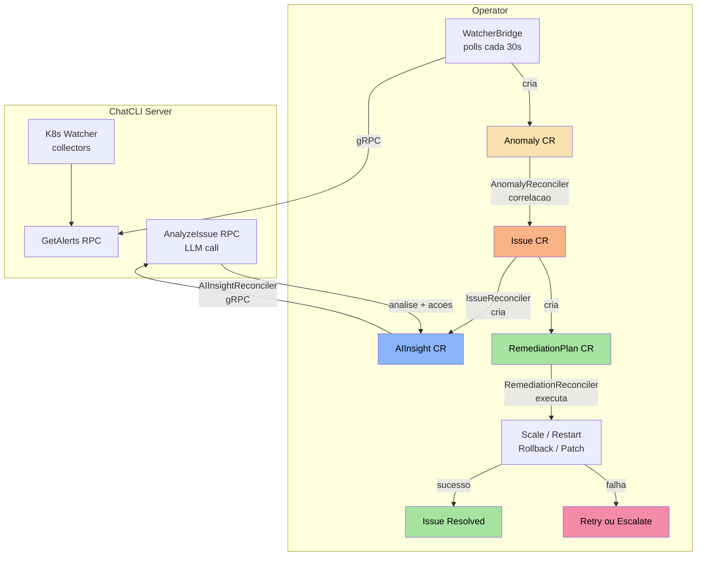

+++
title = "Kubernetes Operator (AIOps)"
linkTitle = "K8s Operator"
weight = 63
description = "Gerencie instancias ChatCLI e uma plataforma AIOps autonoma no Kubernetes com 6 CRDs, correlacao de anomalias, analise por IA e remediacao automatica."
icon = "deployed_code"
+++

O **ChatCLI Operator** vai alem do gerenciamento de instancias. Ele implementa uma **plataforma AIOps completa** que detecta anomalias autonomamente, correlaciona sinais, solicita analise de IA e executa remediacao — tudo sem dependencias externas alem do provedor LLM.

---

## API Group e CRDs

O operator usa o API group `platform.chatcli.io/v1alpha1` com 6 Custom Resource Definitions:

| CRD | Short Name | Descricao |
|-----|-----------|-----------|
| **Instance** | `inst` | Instancia do servidor ChatCLI (Deployment, Service, RBAC, PVC) |
| **Anomaly** | `anom` | Sinal bruto do K8s Watcher (restarts, OOM, falhas de deploy) |
| **Issue** | `iss` | Incidente correlacionado agrupando multiplas anomalias |
| **AIInsight** | `ai` | Analise de causa raiz gerada por IA com acoes sugeridas |
| **RemediationPlan** | `rp` | Acoes concretas para resolver o problema |
| **Runbook** | `rb` | Procedimentos operacionais manuais (opcional) |

---

## Instalacao do Operator

### Via Manifests

```bash
# Instalar todos os CRDs
kubectl apply -f operator/config/crd/bases/

# Instalar RBAC e Manager
kubectl apply -f operator/config/rbac/role.yaml
kubectl apply -f operator/config/manager/manager.yaml
```

### Via Docker Build

```bash
cd operator
make docker-build IMG=ghcr.io/diillson/chatcli-operator:latest
make docker-push IMG=ghcr.io/diillson/chatcli-operator:latest
```

---

## Arquitetura da Plataforma AIOps



### Pipeline Autonomo

| Fase | Componente | O que Faz |
|------|-----------|-----------|
| **1. Deteccao** | WatcherBridge | Consulta `GetAlerts` do servidor a cada 30s. Cria Anomaly CRs para cada alerta novo (dedup via SHA256 com bucket de minuto). |
| **2. Correlacao** | AnomalyReconciler + CorrelationEngine | Agrupa anomalias por recurso + janela temporal. Calcula risk score e severidade. Cria/atualiza Issue CRs. |
| **3. Analise** | IssueReconciler + AIInsightReconciler | Cria AIInsight CR. Chama `AnalyzeIssue` RPC que envia contexto ao LLM. Retorna: analise, confianca, recomendacoes e acoes sugeridas. |
| **4. Remediacao** | IssueReconciler | Cria RemediationPlan a partir de: **(a)** Runbook existente, **(b)** acoes sugeridas pela IA (fallback automatico), ou **(c)** escalona se nenhum disponivel. |
| **5. Execucao** | RemediationReconciler | Executa acoes no cluster: ScaleDeployment, RestartDeployment, RollbackDeployment, PatchConfig. |
| **6. Resolucao** | IssueReconciler | Sucesso → Issue resolvido. Falha → retry (ate maxAttempts) → escalona. |

### Maquina de Estados do Issue


---

## CRD: Instance

O `Instance` gerencia instancias do servidor ChatCLI no cluster. Substitui o antigo `ChatCLIInstance` (`chatcli.diillson.com`).

### Especificacao Completa

```yaml
apiVersion: platform.chatcli.io/v1alpha1
kind: Instance
metadata:
  name: chatcli-prod
  namespace: default
spec:
  replicas: 1
  provider: CLAUDEAI       # OPENAI, CLAUDEAI, GOOGLEAI, XAI, STACKSPOT, OLLAMA
  model: claude-sonnet-4-5

  image:
    repository: ghcr.io/diillson/chatcli
    tag: latest
    pullPolicy: IfNotPresent

  server:
    port: 50051
    tls:
      enabled: true
      secretName: chatcli-tls
    token:
      name: chatcli-auth
      key: token

  watcher:
    enabled: true
    interval: "30s"
    window: "2h"
    maxLogLines: 100
    maxContextChars: 32000
    targets:
      - deployment: api-gateway
        namespace: production
        metricsPort: 9090
        metricsFilter: ["http_requests_*", "http_request_duration_*"]
      - deployment: auth-service
        namespace: production
        metricsPort: 9090
      - deployment: worker
        namespace: batch

  resources:
    requests:
      cpu: 100m
      memory: 128Mi
    limits:
      cpu: 500m
      memory: 512Mi

  persistence:
    enabled: true
    size: 1Gi
    storageClassName: standard

  securityContext:
    runAsNonRoot: true
    runAsUser: 1000
    seccompProfile:
      type: RuntimeDefault

  apiKeys:
    name: chatcli-api-keys
```

### Campos do Spec

#### Raiz

| Campo | Tipo | Obrigatorio | Padrao | Descricao |
|-------|------|:-----------:|--------|-----------|
| `replicas` | int32 | Nao | `1` | Numero de replicas do servidor |
| `provider` | string | **Sim** | | Provedor LLM |
| `model` | string | Nao | | Modelo LLM |
| `image` | ImageSpec | Nao | | Configuracao da imagem |
| `server` | ServerSpec | Nao | | Configuracao do servidor gRPC |
| `watcher` | WatcherSpec | Nao | | Configuracao do K8s Watcher |
| `resources` | ResourceRequirements | Nao | | Requests/limits de CPU e memoria |
| `persistence` | PersistenceSpec | Nao | | Persistencia de sessoes |
| `securityContext` | PodSecurityContext | Nao | nonroot/1000 | Security context do pod |
| `apiKeys` | SecretRefSpec | Nao | | Secret com API keys |

#### WatcherSpec

| Campo | Tipo | Obrigatorio | Padrao | Descricao |
|-------|------|:-----------:|--------|-----------|
| `enabled` | bool | Nao | `false` | Ativa o watcher |
| `targets` | []WatchTargetSpec | Nao | | Lista de deployments (multi-target) |
| `deployment` | string | Nao | | Deployment unico (legado) |
| `namespace` | string | Nao | | Namespace do deployment (legado) |
| `interval` | string | Nao | `"30s"` | Intervalo de coleta |
| `window` | string | Nao | `"2h"` | Janela de observacao |
| `maxLogLines` | int32 | Nao | `100` | Max linhas de log por pod |
| `maxContextChars` | int32 | Nao | `32000` | Budget de contexto LLM |

#### WatchTargetSpec

| Campo | Tipo | Obrigatorio | Padrao | Descricao |
|-------|------|:-----------:|--------|-----------|
| `deployment` | string | **Sim** | | Nome do deployment |
| `namespace` | string | **Sim** | | Namespace do deployment |
| `metricsPort` | int32 | Nao | `0` | Porta Prometheus (0 = desabilitado) |
| `metricsPath` | string | Nao | `/metrics` | Path do endpoint Prometheus |
| `metricsFilter` | []string | Nao | | Filtros glob para metricas |

### Recursos Criados pelo Instance

| Recurso | Nome | Descricao |
|---------|------|-----------|
| **Deployment** | `<name>` | Pods do servidor ChatCLI |
| **Service** | `<name>` | ClusterIP para acesso gRPC |
| **ConfigMap** | `<name>` | Variaveis de ambiente (provider, model, etc.) |
| **ConfigMap** | `<name>-watch-config` | YAML multi-target (se `targets` definido) |
| **ServiceAccount** | `<name>` | Identity para RBAC |
| **Role/ClusterRole** | `<name>-watcher` | Permissoes K8s do watcher |
| **RoleBinding/CRB** | `<name>-watcher` | Binding da SA ao Role |
| **PVC** | `<name>-sessions` | Persistencia (se habilitada) |

### RBAC Automatico

- **Single-namespace** (todos os targets no mesmo namespace): Cria `Role` + `RoleBinding`
- **Multi-namespace** (targets em namespaces diferentes): Cria `ClusterRole` + `ClusterRoleBinding` automaticamente
- Na delecao do CR, cluster-scoped resources sao limpos pelo finalizer

---

## CRDs da Plataforma AIOps

### Anomaly

Representa um sinal bruto detectado pelo WatcherBridge.

```yaml
apiVersion: platform.chatcli.io/v1alpha1
kind: Anomaly
metadata:
  name: watcher-highrestartcount-api-gateway-1234567890
  namespace: production
spec:
  signalType: pod_restart    # pod_restart | oom_kill | pod_not_ready | deploy_failing | error_rate | latency_spike
  source: watcher            # watcher | prometheus | manual
  severity: warning          # critical | high | medium | low | warning
  resource:
    kind: Deployment
    name: api-gateway
    namespace: production
  description: "HighRestartCount on api-gateway: container app restarted 8 times"
  detectedAt: "2026-02-16T10:30:00Z"
status:
  correlated: true
  issueRef:
    name: api-gateway-pod-restart-1771276354
```

#### Campos do Anomaly Spec

| Campo | Tipo | Descricao |
|-------|------|-----------|
| `signalType` | AnomalySignalType | Tipo do sinal detectado |
| `source` | AnomalySource | Origem da deteccao (watcher, prometheus, manual) |
| `severity` | IssueSeverity | Severidade do sinal |
| `resource` | ResourceRef | Recurso K8s afetado (kind, name, namespace) |
| `description` | string | Descricao legivel do problema |
| `detectedAt` | Time | Timestamp da deteccao |

#### Sinais Detectados pelo Watcher

| AlertType (Server) | SignalType (Anomaly) | Descricao |
|--------------------|---------------------|-----------|
| `HighRestartCount` | `pod_restart` | Pod com muitos restarts (CrashLoopBackOff) |
| `OOMKilled` | `oom_kill` | Container terminado por falta de memoria |
| `PodNotReady` | `pod_not_ready` | Pod nao esta no estado Ready |
| `DeploymentFailing` | `deploy_failing` | Deployment com Available=False |

### Issue

Incidente correlacionado que agrupa anomalias e gerencia o ciclo de vida da remediacao.

```yaml
apiVersion: platform.chatcli.io/v1alpha1
kind: Issue
metadata:
  name: api-gateway-pod-restart-1771276354
  namespace: production
spec:
  severity: high
  source: watcher
  description: "Correlated incident: pod_restart on api-gateway"
  resource:
    kind: Deployment
    name: api-gateway
    namespace: production
  riskScore: 65
  correlatedAnomalies:
    - name: watcher-highrestartcount-api-gateway-1234567890
    - name: watcher-oomkilled-api-gateway-1234567891
status:
  state: Analyzing          # Detected | Analyzing | Remediating | Resolved | Escalated | Failed
  remediationAttempts: 0
  maxRemediationAttempts: 3
  detectedAt: "2026-02-16T10:30:00Z"
  conditions:
    - type: Analyzing
      status: "True"
      reason: AIInsightCreated
```

#### Estados do Issue

| Estado | Descricao |
|--------|-----------|
| `Detected` | Issue recem-criado, aguardando analise |
| `Analyzing` | AIInsight criado, aguardando resposta da IA |
| `Remediating` | RemediationPlan em execucao |
| `Resolved` | Remediacao bem-sucedida |
| `Escalated` | Max tentativas atingido ou sem acoes disponiveis |
| `Failed` | Falha terminal |

### AIInsight

Analise de causa raiz gerada por IA com acoes sugeridas para remediacao automatica.

```yaml
apiVersion: platform.chatcli.io/v1alpha1
kind: AIInsight
metadata:
  name: api-gateway-pod-restart-1771276354-insight
  namespace: production
spec:
  issueRef:
    name: api-gateway-pod-restart-1771276354
  provider: CLAUDEAI
  model: claude-sonnet-4-5
status:
  analysis: "High restart count caused by OOMKilled. Container memory limit (512Mi) is insufficient for the current workload pattern."
  confidence: 0.87
  recommendations:
    - "Increase memory limit to 1Gi"
    - "Investigate possible memory leak in the application"
    - "Monitor GC pressure metrics"
  suggestedActions:
    - name: "Restart deployment"
      action: RestartDeployment
      description: "Restart pods to reclaim leaked memory immediately"
    - name: "Scale up replicas"
      action: ScaleDeployment
      description: "Add more replicas to distribute memory pressure"
      params:
        replicas: "4"
  generatedAt: "2026-02-16T10:31:00Z"
```

#### Campos do AIInsight Status

| Campo | Tipo | Descricao |
|-------|------|-----------|
| `analysis` | string | Analise de causa raiz gerada pela IA |
| `confidence` | float64 | Nivel de confianca da analise (0.0-1.0) |
| `recommendations` | []string | Recomendacoes legiveis para humanos |
| `suggestedActions` | []SuggestedAction | Acoes estruturadas para remediacao automatica |
| `generatedAt` | Time | Quando a analise foi gerada |

#### SuggestedAction

| Campo | Tipo | Descricao |
|-------|------|-----------|
| `name` | string | Nome legivel da acao |
| `action` | string | Tipo da acao: `ScaleDeployment`, `RestartDeployment`, `RollbackDeployment`, `PatchConfig` |
| `description` | string | Explicacao do motivo desta acao |
| `params` | map[string]string | Parametros da acao (ex: `replicas: "4"`) |

### RemediationPlan

Plano concreto de remediacao gerado automaticamente a partir de Runbook ou acoes da IA.

```yaml
apiVersion: platform.chatcli.io/v1alpha1
kind: RemediationPlan
metadata:
  name: api-gateway-pod-restart-1771276354-plan-1
  namespace: production
spec:
  issueRef:
    name: api-gateway-pod-restart-1771276354
  attempt: 1
  strategy: "Attempt 1 (AI-generated): High restart count caused by OOMKilled"
  actions:
    - type: RestartDeployment
    - type: ScaleDeployment
      params:
        replicas: "4"
  safetyConstraints:
    - "No delete operations"
    - "No destructive changes"
    - "Rollback on failure"
status:
  state: Completed           # Pending | Executing | Completed | Failed | RolledBack
  result: "Deployment restarted and scaled to 4 replicas successfully"
  startedAt: "2026-02-16T10:31:30Z"
  completedAt: "2026-02-16T10:32:15Z"
```

#### Tipos de Acao

| Tipo | Descricao | Parametros |
|------|-----------|-----------|
| `ScaleDeployment` | Ajusta o numero de replicas | `replicas` |
| `RestartDeployment` | Rollout restart do deployment | — |
| `RollbackDeployment` | Desfaz o ultimo rollout | — |
| `PatchConfig` | Atualiza chaves de um ConfigMap | `configmap`, `key=value` |
| `Custom` | Acao personalizada (bloqueada por safety checks) | — |

### Runbook (Opcional)

Procedimentos operacionais manuais. Quando um Runbook corresponde ao issue, ele tem prioridade sobre as acoes da IA.

```yaml
apiVersion: platform.chatcli.io/v1alpha1
kind: Runbook
metadata:
  name: high-error-rate-deployment
  namespace: production
spec:
  description: "Standard procedure for high error rate incidents on Deployments"
  trigger:
    signalType: error_rate
    severity: high
    resourceKind: Deployment
  steps:
    - name: Scale up
      action: ScaleDeployment
      description: "Increase replicas to absorb the error spike"
      params:
        replicas: "4"
    - name: Rollback
      action: RollbackDeployment
      description: "Revert to previous stable version if scaling doesn't help"
  maxAttempts: 3
```

#### Prioridade de Remediacao

```
1. Runbook existente que corresponde (signalType + severity + resourceKind)
2. Acoes sugeridas pela IA (suggestedActions do AIInsight)
3. Escalonamento (se nenhum dos dois disponiveis)
```

---

## Correlation Engine

O motor de correlacao agrupa anomalias em issues usando:

### Risk Scoring

Cada tipo de sinal tem um peso:

| Sinal | Peso |
|-------|------|
| `oom_kill` | 30 |
| `error_rate` | 25 |
| `deploy_failing` | 25 |
| `latency_spike` | 20 |
| `pod_restart` | 20 |
| `pod_not_ready` | 20 |

O risk score e a soma dos pesos das anomalias correlacionadas (maximo 100).

### Classificacao de Severidade

| Risk Score | Severidade |
|-----------|-----------|
| >= 80 | Critical |
| >= 60 | High |
| >= 40 | Medium |
| < 40 | Low |

### Agrupamento

- Anomalias no **mesmo recurso** (deployment + namespace) dentro da **mesma janela temporal** sao agrupadas no mesmo Issue
- **Incident ID** deterministico: hash do recurso + tipo de sinal (evita duplicatas)

---

## WatcherBridge

O `WatcherBridge` e o componente que conecta o servidor ChatCLI ao operator:

- **Polling**: Consulta `GetAlerts` do servidor a cada 30 segundos
- **Descoberta**: Localiza o servidor via Instance CRs (primeiro Instance com endpoint gRPC pronto)
- **Dedup**: Hash SHA256 com bucket de minuto + TTL de 2 horas
- **Poda**: Remove hashes expirados automaticamente (> 2h)
- **Criacao**: Converte alertas em Anomaly CRs com nomes K8s validos

---

## Exemplos de Uso

### Minimo (sem AIOps)

```yaml
apiVersion: platform.chatcli.io/v1alpha1
kind: Instance
metadata:
  name: chatcli-simple
spec:
  provider: OPENAI
  apiKeys:
    name: chatcli-api-keys
```

### AIOps Completo

```yaml
apiVersion: platform.chatcli.io/v1alpha1
kind: Instance
metadata:
  name: chatcli-aiops
spec:
  provider: CLAUDEAI
  apiKeys:
    name: chatcli-api-keys
  server:
    port: 50051
  watcher:
    enabled: true
    interval: "15s"
    maxContextChars: 32000
    targets:
      - deployment: api-gateway
        namespace: production
        metricsPort: 9090
        metricsFilter: ["http_*", "grpc_*"]
      - deployment: auth-service
        namespace: production
        metricsPort: 9090
      - deployment: worker
        namespace: batch
      - deployment: ml-inference
        namespace: ml
        metricsPort: 8080
  resources:
    requests:
      cpu: 200m
      memory: 256Mi
    limits:
      cpu: "1"
      memory: 1Gi
  persistence:
    enabled: true
    size: 5Gi
```

### Runbook Manual (opcional)

```yaml
apiVersion: platform.chatcli.io/v1alpha1
kind: Runbook
metadata:
  name: oom-kill-runbook
  namespace: production
spec:
  description: "Procedure for OOMKilled containers"
  trigger:
    signalType: oom_kill
    severity: critical
    resourceKind: Deployment
  steps:
    - name: Restart pods
      action: RestartDeployment
      description: "Restart to reclaim leaked memory"
    - name: Scale up
      action: ScaleDeployment
      description: "Add replicas to distribute memory pressure"
      params:
        replicas: "5"
  maxAttempts: 2
```

### Secret de API Keys

```yaml
apiVersion: v1
kind: Secret
metadata:
  name: chatcli-api-keys
type: Opaque
stringData:
  ANTHROPIC_API_KEY: "sk-ant-xxx"
  # OPENAI_API_KEY: "sk-xxx"
  # GOOGLE_AI_API_KEY: "xxx"
```

---

## Status e Monitoramento

### Verificar Instancias

```bash
kubectl get instances
```
```
NAME            READY   REPLICAS   PROVIDER    AGE
chatcli-aiops   true    1          CLAUDEAI    5m
```

### Verificar Issues Ativos

```bash
kubectl get issues -A
```
```
NAME                                    SEVERITY   STATE         RISK   AGE
api-gateway-pod-restart-1771276354      high       Remediating   65     2m
worker-oom-kill-3847291023              critical   Analyzing     90     30s
```

### Verificar Insights da IA

```bash
kubectl get aiinsights -A
```
```
NAME                                           ISSUE                                   PROVIDER   CONFIDENCE   AGE
api-gateway-pod-restart-1771276354-insight      api-gateway-pod-restart-1771276354      CLAUDEAI   0.87         1m
```

### Verificar Planos de Remediacao

```bash
kubectl get remediationplans -A
```
```
NAME                                          ISSUE                                   ATTEMPT   STATE       AGE
api-gateway-pod-restart-1771276354-plan-1      api-gateway-pod-restart-1771276354      1         Completed   1m
```

### Verificar Anomalias

```bash
kubectl get anomalies -A
```
```
NAME                                               SIGNAL        SOURCE    SEVERITY   AGE
watcher-highrestartcount-api-gateway-1234567890     pod_restart   watcher   warning    3m
watcher-oomkilled-worker-9876543210                 oom_kill      watcher   critical   1m
```

---

## Desenvolvimento

```bash
cd operator

# Build
go build ./...

# Testes (80 testes)
go test ./... -v

# Docker
make docker-build IMG=myregistry/chatcli-operator:dev

# Instalar CRDs no cluster
kubectl apply -f config/crd/bases/

# Deploy o operator
make deploy IMG=myregistry/chatcli-operator:dev
```

---

## Proximo Passo

- [AIOps Platform (deep-dive arquitetura)](/docs/features/aiops-platform/)
- [K8s Watcher (detalhes de coleta e budget)](/docs/features/k8s-watcher/)
- [Modo Servidor (RPCs GetAlerts e AnalyzeIssue)](/docs/features/server-mode/)
- [Receita: Monitoramento K8s com IA](/docs/cookbook/k8s-monitoring/)
